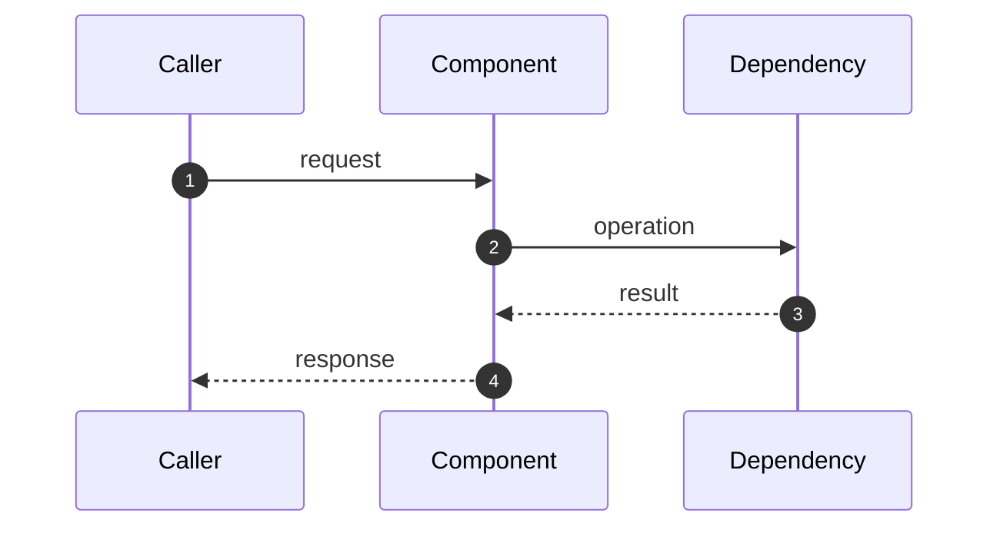

<!--
Name the outcome in the title: "Add [target] language adapter" instead of "[target] changes".
Delete any section that does not help reviewers understand or verify the change.
-->

## Summary

<!--
In 2–4 sentences, explain what changed, why, and where the change stops.
Mention anything a reviewer might reasonably expect to be included but is not.
-->

## Architecture & Data Flow

<!--
Show how data moves when the change crosses processes, services, repositories, or storage boundaries.
Rename the participants and replace the sample messages below. If a diagram adds nothing, delete this section.
-->



## Key Changes

<!--
Group related work by module or repository area. Explain the behavior each group adds or changes.
Skip files that reviewers can understand from the diff. Include configuration and documentation when they change how the feature works.
-->

- **`path/to/module/`**: What this area now does and why.
- **`path/to/file`**: The behavior, contract, or integration changed here.

## Protocol & Compatibility

<!--
Record changes to protocols, public APIs, schemas, CLI behavior, and stored data.
Be exact about versions, ordering, limits, exit codes, backward compatibility, and migration steps.
Delete this section when no contract changed.
-->

## Verification & Benchmarks

<!--
Paste the evidence you used to verify the change. Include the command and environment when they affect the result.
Use measured numbers for performance, coverage, or test selection claims. Remove secrets and personal data from output.
-->

### Test Suite Results

```text
# Command: <command>
# Environment: <OS/runtime/tool version, if relevant>

<concise test output or result summary>
```

### Benchmark or Representative Run

<!--
Name the repository or workload, its size, and the comparison baseline so someone else can judge the result.
Delete this subsection when the change has nothing useful to benchmark.
-->

```text
<measured result>
```

### Sample Input or Output

<!--
For protocol, CLI, API, or schema work, include one small example that exercises the changed behavior.
Use the right code-block language. Delete this subsection when an example would repeat the tests or diff.
-->

```json
{
  "example": "replace with a representative payload"
}
```

## Review Notes

<!--
Point reviewers to the decisions and risks that need a closer look. Link follow-up work instead of hiding it in prose.
Delete this section when there is nothing to call out.
-->
