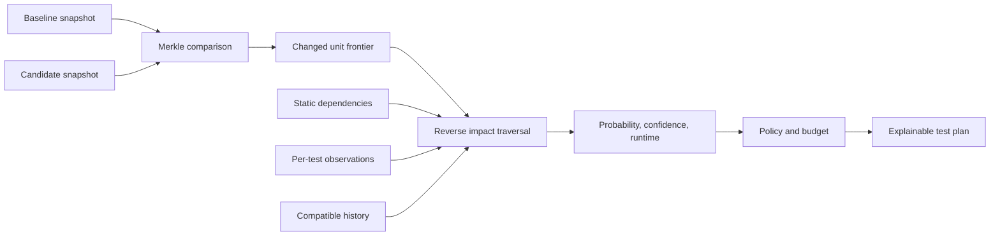

# Merkle

Merkle is a self-hosted test-impact assistant. It compares a baseline repository snapshot with a candidate snapshot, identifies changed source units, traces their likely impact, and returns an explainable list of relevant tests.

**Status:** Roadmap phases 0–5 are implemented behind versioned seams. The C#/.NET 10 Native AOT CLI supports planning, serial .NET observation, policy-gated selected execution, local/remote history, and transactional state. Runtime observation is intentionally coarse: the startup hook records assembly/project evidence and reports its member/reflection/native/child-process blind spots.

The designed RFC is available as [Word](Merkle-Test-Impact-System-Design.docx) and [PDF](Merkle-Test-Impact-System-Design.pdf). Those rendered artifacts predate ADR-0015; the Markdown specification and ADRs are authoritative for the .NET 10/Native AOT decision. See the [QA report](QA-REPORT.md) for render, accessibility, privacy, and package checks.

## Why this exists

Large test suites make every development step expensive. The cost compounds when several developers and coding agents work in parallel: each commit can trigger far more tests than the changed behavior justifies, yet skipping tests blindly makes feedback unreliable.

Merkle shortens commit and pull-request feedback by selecting the tests most relevant to a change. The repository's normal CI/CD system still owns scheduled full-suite, release, coverage, security, and compliance gates.

The tool produces the best explainable plan available from structural, runtime, and historical evidence, then leaves the acceptable risk to the repository owner. It cannot prove that every omitted test passes.

## How it differs

| Approach | What it knows | Main limitation | Merkle's difference |
|---|---|---|---|
| Path-only rules | Changed files and configured directory patterns | Shared code and member-level dependencies are easy to over- or under-select | Descends a semantic Merkle index, then follows reverse dependencies from changed units |
| Always run the full suite | Every configured test is executed | Reliable but often too slow for each commit sequence | Estimates whether a smaller plan has enough evidence and meaningful runtime savings |
| Declaration-only/static selection | Imports, references, ownership, or hand-written mappings | Cannot tell which code a test exercised and mappings age quickly | Adds serial per-test runtime observations and compatible historical evidence |
| Coverage-only selection | Which code was reached in a prior run | Coverage may be stale, coarse, or unavailable for new code | Treats runtime observation as one evidence source, with static fallback and explicit confidence |
| Historical correlation only | Which changes and outcomes occurred together | Cold starts, censored selected-only runs, and correlation errors | Combines history with current semantic structure and keeps probability separate from confidence |

Consider a shared `Currency` feature. If `Currency.X` is used only by Payments, a member-level graph can select tests for `Currency.X` and Payments. If `Currency.Y` is used by both Payments and Orders, the reverse impact paths reach both branches. A directory-only selector would normally choose all Currency consumers or rely on manually maintained exceptions.

## The model



The Merkle index answers what changed. The reverse impact graph and evidence model answer which tests may matter. They remain separate responsibilities.

## Guarantee boundary

**Accepted:** Merkle is advisory. It does not guarantee that an unselected test cannot fail and is not a replacement for a full regression suite.

Every plan must expose:

- selected tests and stable test identities;
- reasons and evidence paths for each selection;
- estimated impact probability;
- evidence confidence as a separate value;
- expected selected and full-suite durations when comparable data exists;
- unmapped changed units and incompatible history; and
- the policy that made the final recommendation.

Run the full suite periodically, such as in a nightly job. Those complete runs supply the calibration data for measuring misses. Selected-only runs must never teach the model that an unexecuted test was safe.

## Accepted product boundaries

- Pull requests compare target merge base with current head by default.
- Local runs compare an explicit/configured baseline with a commit, branch, or frozen working tree.
- Local state lives beneath the repository and should be ignored by Git.
- The project does not provide a hosted service; teams may supply their own remote or bare-metal state provider.
- Mixed-language repositories require explicit language/profile selection and list all detected languages when missing.
- A first-party deep adapter targets .NET 6+ on macOS and Linux; WSL is best-effort and native Windows is out of scope.
- The official .NET adapter must not add NuGet packages or other dependencies to the repository under analysis.
- Build is enabled by default. `--no-build` is valid only with compatible existing artifacts.
- Compilation failure is an analysis error; dependency/setup failures reported by a test are ordinary test failures.
- Initial deep per-test observation is serial.
- Unmapped changed code is reported and allowed by default; a pedantic policy may reject it.
- No timeout is imposed by default. An explicit `timeoutMs`/`--timeout-ms` enables one.
- The initial .NET scope supports one solution.
- TypeScript is not in the first-party scope. A later Go adapter is only a candidate.
- Third-party adapters are capability-negotiated but not guaranteed by the core project.

## CLI

Plan a pull request without running tests:

```bash
merkle plan --languages dotnet:deep
```

Compare a working tree with a development branch and return JSON:

```bash
merkle plan \
  --base development \
  --head WORKTREE \
  --languages dotnet:deep \
  --format json
```

Build, select, and run the approved plan:

```bash
merkle run \
  --base origin/main \
  --head HEAD \
  --languages dotnet:deep
```

Reuse a compatible build and apply an explicit timeout:

```bash
merkle run \
  --languages dotnet:deep \
  --no-build \
  --timeout-ms 120000
```

Inspect or reset disposable local state:

```bash
merkle state status
merkle state reset --local
```

Import a schema-1 JSON terminal report from an official CI run:

```bash
merkle history import path/to/terminal-report.json
```

Future mixed-language syntax may look like this, but only adapters that advertise the requested capabilities can run:

```bash
merkle plan --languages dotnet:deep,golang:minimal
```

## Repository configuration

```yaml
schemaVersion: 1

repository:
  solution: Example.sln
  stateDirectory: .merkle
  # reviewed UUID shared only by trusted clones
  repositoryId: 019fde48-89db-7230-b822-c9f25c100df8

languages:
  dotnet:
    profile: deep

baseline:
  localRef: development
  prStrategy: merge-base

execution:
  build: true
  serialObservation: true
  # timeoutMs omitted: no timeout

policy:
  minSavingsPercent: 30
  confidenceThreshold: null
  onLowConfidence: null
  unmapped: warn
```

**Accepted:** 30% is the fallback minimum estimated saving when comparable full-suite timing exists. Teams that value a 10–20% margin can configure a lower value. Confidence thresholds and low-confidence actions have no universal default; the repository owner must choose them before automatic substitution is allowed.

Copyable files are included in [`examples/merkle.yml`](examples/merkle.yml) and [`examples/gitignore.snippet`](examples/gitignore.snippet).

## Documentation map

- [Build and usage](USAGE.md): local development, Native AOT packaging, deployment, CLI workflows, and remote-history serving boundaries.
- [Domain context](CONTEXT.md): implementation-free vocabulary used across the project.
- [Documentation index](docs/index.md): ownership, status, and reading paths.
- [System design](docs/system-design.md): complete architecture and rationale.
- [Specification](docs/specification.md): normative behaviors, failure semantics, and acceptance criteria.
- [Implementation guide](docs/implementation-guide.md): seams, invariants, data flow, and vertical delivery order.
- [Roadmap](docs/roadmap.md): phases, decision gates, and exit criteria.
- [Adapter authoring](docs/adapter-authoring.md): minimal/deep capability contract for contributors.
- [CI and remote-state operations](docs/operations.md): runner trust, cache, remote API, and release verification.
- [Language options](docs/language-options.md): implementation-language effort and toolkit analysis.
- [Conversation decisions](docs/conversation-decisions.md): how the product constraints were reached.
- [Architecture decision records](docs/adr/README.md): accepted, superseded, and deferred decisions.

## Build and release

The Native AOT CLI keeps Roslyn and test-platform work in companion managed processes. CI builds and tests on macOS and Linux, enforces 80% aggregate line and branch coverage, publishes self-contained artifacts for x64 and Arm64, and attaches signed GitHub build-provenance attestations. Analyzed repositories receive no package or project changes.

The 2026-08-07 verification run passed 289 Release tests with 92.80% line and 81.59% branch coverage. The macOS Arm64 Native AOT package launched successfully, initialized SQLite schema 2, and contained the managed semantic worker and startup-hook observer at their resolved package paths.
