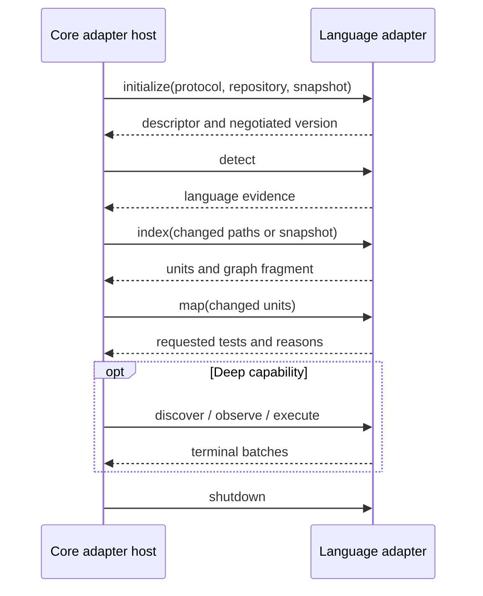

# Adapter authoring guide

Status: Protocol 1.0 adapter contract  
Audience: contributors adding language ecosystems  
Related: [domain context](../CONTEXT.md), [specification](specification.md), [implementation guide](implementation-guide.md)

Language adapters translate ecosystem-specific source and test behavior into Merkle's shared domain. A minimal adapter can stop at changed-code-to-test mapping. Discovery, profiling, execution, and reporting are optional deeper capabilities. The adapter must fail explicitly for every operation it does not provide.

Repository owners decide whether to use third-party adapters. The conformance suite checks protocol behavior; it cannot guarantee complete test selection.

## 1. Capability profiles

| Capability | Minimal | Deep | Meaning |
|---|---:|---:|---|
| `detect` | Required | Required | Explain whether the language exists in the snapshot |
| `index` | Required | Required | Produce stable source units and structural inputs |
| `map` | Required | Required | Return requested tests and explanation paths for changed units |
| `discover` | Optional | Required | Produce a stable catalog of tests |
| `observe` | Optional | Required | Attribute runtime source units to individual tests |
| `execute` | Optional | Required | Run selected stable test identities |
| `report` | Optional | Required | Normalize detailed test outcomes and durations |

`minimal` and `deep` are convenience profiles. Capability negotiation remains per operation so future adapters can describe an intermediate set accurately.

**Accepted:** requesting a missing capability is an error. The engine must not silently substitute a weaker behavior.

## 2. Descriptor

An adapter session begins with a descriptor similar to:

```json
{
  "adapterProtocol": "1.0",
  "language": "golang",
  "producer": "example-community",
  "adapterVersion": "0.1.0",
  "unitIdentityVersion": "1",
  "testIdentityVersion": "1",
  "capabilities": ["detect", "index", "map"],
  "platforms": ["linux-x64", "darwin-arm64"],
  "profiles": ["minimal"]
}
```

The language name must be stable and lowercase. Producer and version must appear in terminal reports. Capabilities are authoritative; profile names are descriptive.

## 3. Process protocol

Protocol 1.0 uses a versioned request/response boundary that can run out of process. This keeps adapter authors independent of the core language and isolates ecosystem dependencies.



Protocol requirements:

- one request ID per operation;
- explicit protocol and identity versions;
- bounded message and batch sizes;
- deterministic ordering inside batches;
- structured progress that cannot be mistaken for a terminal response;
- structured cancellation and terminal error codes;
- no secrets in diagnostics by default; and
- no dependency on terminal formatting.

The initial transport is one bounded JSON request on standard input and one bounded JSON response on standard output. Standard error carries bounded diagnostics. A request ID binds the response to the operation, and stdout noise makes the envelope invalid.

## 4. Stable identities

### Source units

A source unit identity should contain the semantic coordinates needed to distinguish equivalent declarations without embedding machine-specific absolute paths.

Examples:

```text
file:<normalized-repository-path>
dotnet:<project>/<namespace>/<containing-types>/<metadata-member-signature>
golang:<module>/<package>/<receiver?>/<function-or-method>
```

Rules:

- normalization is documented and versioned;
- repository paths use `/` separators and repository-relative casing rules;
- overloads/generic arity are unambiguous;
- display names are separate from identities;
- rename may be represented as delete/add initially;
- an identity version change invalidates or migrates history explicitly; and
- generated units state their source/input relationship.

### Test identities

Test identities must distinguish tests that share display text and remain stable across runner output formatting. Include framework-specific coordinates such as assembly/package, containing type or package, method/function, parameterization identity, and traits only when they are identity-bearing.

Never use execution order as identity.

## 5. Detection

`detect` returns zero or more evidence records:

```json
{
  "language": "golang",
  "confidence": "high",
  "evidence": [
    {"kind": "manifest", "path": "go.mod"},
    {"kind": "source", "count": 42}
  ]
}
```

Detection must not claim repository ownership or decide whether another detected language is incidental. The core asks the user to resolve mixed-language scope.

## 6. Indexing

`index` returns:

- stable source units;
- unit kind and repository-relative location;
- canonical semantic signatures or hashes;
- containment edges;
- static dependency edges when available;
- invalidation roots for build/configuration inputs; and
- warnings for constructs the adapter cannot model.

The core builds the global Merkle tree from deterministic language fragments supplied by adapters. It also owns the cross-language hierarchy, hashing schema, and comparison.

Ordering must be stable. If a language construct has no safe semantic identity, return a file-level unit and a confidence warning instead of inventing member precision.

## 7. Minimal mapping

`map` is the minimum useful test-impact operation. Given changed units and the adapter's compatible index, return:

```json
{
  "requestedTests": [
    {
      "testIdentity": "golang:example.com/payments/currency:TestRound",
      "displayName": "TestRound",
      "reasons": [
        {
          "kind": "static-dependency",
          "changedUnit": "golang:example.com/shared/currency:Round",
          "path": [
            "golang:example.com/shared/currency:Round",
            "golang:example.com/payments/currency:Calculate",
            "golang:example.com/payments/currency:TestRound"
          ]
        }
      ]
    }
  ],
  "unmappedUnits": []
}
```

This Go example illustrates the contract. A Go adapter remains deferred.

Requirements:

- every requested test has a stable identity and at least one reason;
- reasons identify their evidence kind;
- unmapped changed units are explicit;
- ancestor/project expansion is identified as fallback evidence;
- results are deterministic for the same inputs; and
- the adapter does not decide runtime budget or confidence policy.

## 8. Discovery

`discover` returns the complete test catalog for the requested scope and build fingerprint. It should include stable identity, display name, framework, source location when available, traits/tags, and execution selector material kept separate from identity.

A previously known test absent from discovery is deleted or unavailable, not silently retained as executable.

## 9. Observation

`observe` attributes runtime source units to one stable test identity under a build fingerprint.

Each record includes:

```text
testIdentity
unitIdentity
buildFingerprint
adapterVersion
observationKind
count or presence
runId
```

An adapter must document blind spots such as reflection, subprocesses, native calls, code generation, coverage filters, or runtime optimization. Incomplete observation reduces confidence; it must not be reported as complete coverage.

**Accepted for official .NET v1:** observation is serial and must not add dependencies to the repository. Another adapter may support parallel observation only if it can demonstrate unambiguous attribution and advertises that behavior separately.

## 10. Execution and reporting

`execute` receives stable test identities and immutable build/snapshot context. It returns normalized terminal states:

```text
passed | failed | skipped | timed-out | crashed | cancelled
```

Keep adapter-specific details in bounded structured metadata. A dependency or setup failure surfaced by the test runner is `failed`. A compiler failure or missing required build artifact stops a valid test run from starting and is an analysis error.

No timeout is assumed. The adapter enforces one only when the request supplies `timeoutMs`.

## 11. Errors

Use structured errors:

| Error | When to use |
|---|---|
| `UnsupportedProtocol` | No common protocol version exists |
| `CapabilityUnavailable` | Requested operation is not advertised |
| `InvalidRequest` | Required or versioned fields are invalid |
| `IdentityIncompatible` | Stored/current identity versions cannot be compared |
| `SnapshotIncompatible` | Adapter inputs do not match the bound snapshot |
| `BuildFailed` | Compilation/build prevents analysis or execution |
| `ArtifactsUnavailable` | Strict no-build validation fails |
| `AdapterCrashed` | Adapter terminates without a valid terminal response |
| `ObservationIncomplete` | Observation completed with declared blind spots or loss |

Do not encode error class only in a message. Unknown errors become a bounded `AdapterCrashed`/internal diagnostic at the host boundary.

## 12. Configuration ownership

Common concepts belong to the core:

- baseline/candidate;
- language/profile selection;
- build versus no-build;
- timeout;
- unmapped policy;
- plan budget and confidence policy; and
- report format.

Language-specific configuration belongs under the adapter's language namespace. Validate unknown keys and return schema/version diagnostics. An adapter must not reinterpret core policy fields.

## 13. Security and process behavior

- Treat repository build/test commands as arbitrary code execution.
- Never download or install another adapter automatically from repository content.
- Resolve executable paths explicitly and report producer/version.
- Bound input, output, diagnostics, graph sizes, and batch counts.
- Keep protocol and human diagnostics on distinct channels.
- Do not emit complete environments or secrets.
- Honor cancellation and close child processes.
- Write only to the host-provided run/state paths.
- Do not edit source, manifests, lockfiles, project files, or `.gitignore`.

Adapters may require ecosystem toolchains, but must explain missing-toolchain errors. The official project decides what gets bundled only for first-party adapters.

## 14. Conformance suite

Every adapter should pass fixtures for:

### Protocol

- successful and failed negotiation;
- unknown request/capability;
- cancellation;
- partial/malformed/bounded messages;
- deterministic batch ordering; and
- clean terminal shutdown.

### Identity

- stable repeated discovery;
- overloads/parameterization;
- rename as documented;
- deleted units/tests;
- path normalization; and
- identity-version incompatibility.

### Mapping

- direct test relationship;
- transitive dependency;
- shared source used by two features;
- cycles;
- ancestor fallback;
- unmapped source; and
- explanation-path determinism.

### Deep capabilities

- compatible/incompatible build fingerprints;
- one-test attribution;
- failed/skipped/crashed outcomes;
- no timeout and explicit timeout;
- interrupted observation; and
- declared blind spots.

Passing results should identify operating system, architecture, ecosystem toolchain, adapter version, and protocol version.

## 15. Contribution checklist

- [ ] Choose a stable language and producer identifier.
- [ ] Implement descriptor and protocol negotiation.
- [ ] Document source-unit and test-identity version 1.
- [ ] Implement deterministic detection, indexing, and minimal mapping.
- [ ] Return explicit unmapped units and explanation paths.
- [ ] Declare only implemented capabilities.
- [ ] Normalize errors and keep diagnostics bounded/redacted.
- [ ] Add golden repositories and conformance results.
- [ ] Document supported OS/toolchain/framework matrix and blind spots.
- [ ] Add migration/rebuild behavior before changing identities.
- [ ] Avoid source-project dependency or manifest changes unless the adapter is explicitly third-party and documents that tradeoff; such an adapter cannot claim official .NET compatibility.

## 16. Compatibility and support statement

Protocol compatibility, adapter correctness, and language support are separate claims. The core may support a protocol version while a third-party adapter remains experimental. Terminal reports must include producer, version, capability, identity, and platform details so users can judge that adapter.

The first project-owned deep implementation targets .NET 6+. TypeScript is out. Go may be evaluated later. This design promises no second project-owned adapter.
