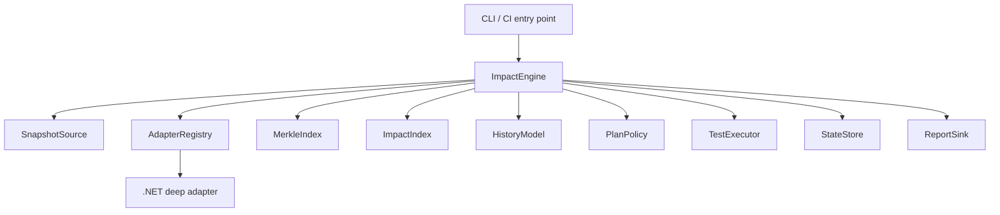

# Implementation guide

Status: Implemented schema 1 guide  
Normative behavior: [Specification](specification.md)  
Architecture rationale: [System design](system-design.md)

The core implementation uses C# on .NET 10. The CLI publishes with Native AOT; libraries stay trimming-safe and avoid reflection-based contracts. Roslyn runs in a managed semantic worker, and runtime observation runs in a managed startup hook. Both ship beside the native CLI behind versioned seams.

The repository starts with `Merkle.slnx`, `global.json`, and SDK-style projects under `src/`. Project dependencies point inward toward domain contracts; the CLI is a composition root, not a home for planning behavior.

## 1. Build around one deep facade

The public engine surface should be small:

```text
ImpactEngine.PlanAsync(PlanRequest)                 -> TerminalReport
DeepExecutionEngine.ExecuteAsync(DeepExecutionRequest) -> TerminalReport
HistoryImportService.ImportAsync(path)              -> TerminalReport
IStateStore status/reset/publication                -> state result
```

The facade binds snapshots, validates capabilities, coordinates the work, classifies terminal errors, and publishes results atomically. Callers should not coordinate Merkle descent, dependency traversal, SQL queries, observation events, or plan economics.



## 2. Module responsibilities

### `SnapshotSource`

`SnapshotSource` resolves Git refs and PR merge bases, diagnoses shallow history, enumerates changed paths, freezes working trees, and reads immutable snapshots. No other module should assemble Git commands or infer CI refs.

### `LanguageDetector` and `AdapterRegistry`

Detection reports evidence. In mixed repositories, the user chooses the languages. The registry resolves explicit `language:profile` selections, starts adapter sessions, and validates protocol, identity, and capability versions before indexing.

### `LanguageAdapter`

Translates one ecosystem into shared source units, tests, graph edges, observations, and execution outcomes. Protocol 1.0 defines the bounded process boundary for third-party adapters and the managed .NET semantic worker.

### `MerkleIndex`

`MerkleIndex` handles canonical encoding, hashing, child order, incremental replacement, schema versions, and root comparison. It reports what changed. Test relevance belongs to the impact planner.

### `ImpactIndex`

`ImpactIndex` stores containment, static dependency, dynamic observation, and historical association edges for reverse traversal. It returns candidate evidence paths for `PlanPolicy` to evaluate.

### `HistoryModel`

`HistoryModel` validates sample compatibility, tracks sufficient statistics, estimates impact probability and evidence confidence, and maintains runtime means and variance. It treats selected-only absence as censored data.

### `PlanPolicy`

`PlanPolicy` combines mandatory tests, ranked discretionary tests, runtime budget, minimum savings, and the repository's risk policy. Cost never increases the recorded evidence strength.

### `TestExecutor`

`TestExecutor` builds by default, validates `--no-build`, launches the selected runner, enforces explicit timeouts, and normalizes outcomes. It executes an immutable plan and never recalculates impact.

### `StateStore`

`StateStore` hides transactions, indexing, object storage, schema migration, journals, and atomic publication. Local and remote implementations must satisfy the same behavioral contract.

### `ReportSink`

`ReportSink` renders a canonical result as stable text, JSON, or CI annotations. Formatting cannot alter planning behavior.

## 3. Non-negotiable invariants

1. Baseline and candidate are immutable before expensive work starts.
2. Equal inputs, versions, evidence cutoff, and configuration produce equal roots and plan ordering.
3. Source-unit identity and test identity are versioned independently.
4. A Merkle difference is not impact evidence.
5. An unexecuted test in a selected-only run is never a negative label.
6. Impact probability and evidence confidence are stored and reported separately.
7. Runtime cost never removes an exact mandatory relationship.
8. Only terminal runs can publish results or admitted evidence.
9. A reader never sees another run's partial state.
10. The official .NET adapter does not modify target dependency declarations.
11. Unsupported adapter capabilities fail explicitly.
12. Analysis, test, configuration, capability, and policy failures remain distinct.

## 4. End-to-end plan flow

```text
1. Resolve repository and effective redacted configuration.
2. Freeze baseline and candidate snapshot identities.
3. Detect languages; require explicit selections for mixed repositories.
4. Negotiate adapter capabilities and identity versions.
5. Load compatible baseline/candidate indexes or build them.
6. Compare Merkle roots and emit the changed frontier.
7. Traverse reverse impact evidence into requested-test candidates.
8. Read compatible dynamic/history statistics.
9. Estimate probability, confidence, and runtime for each candidate.
10. Apply mandatory rules, budget, savings, and configured risk policy.
11. Persist a terminal report in the run journal.
12. Atomically publish the report and valid evidence.
```

The `run` path adds build validation and test execution after step 10. The final publication includes plan and outcomes in one terminal view.

## 5. Canonical Merkle construction

### Unit hierarchy

The portable fallback is repository → language root → project/module → path → file. The .NET adapter may enrich it with namespace → type → member. A file remains the fallback for inputs that cannot be modeled semantically.

### Encoding

Use length-delimited fields and domain tags, not concatenated display strings:

```text
unitHash = H(
  "merkle/unit/v1",
  unitKind,
  stableUnitIdentity,
  normalizedContentHash,
  semanticSignature
)

nodeHash = H(
  "merkle/node/v1",
  nodeKind,
  stableUnitIdentity,
  sortByIdentity(children(identity, hash))
)
```

Hash schema 1 uses SHA-256. Any algorithm change requires a new hash identifier and index schema.

### Incremental update

1. Ask `SnapshotSource` for changed paths.
2. Reparse changed source/build inputs through the adapter.
3. Replace added/deleted/changed leaves.
4. Recompute only their containment ancestors.
5. Invalidate graph fragments reached from semantically broad build inputs.
6. Optionally run a full verification scan and compare roots.

Do not use timestamps as content truth. They may be a cache hint only.

### Comparison

If roots match, semantic inputs are unchanged. If roots differ, descend ordered children until added, deleted, or unequal leaves reach the configured granularity. Return those leaves plus relevant containment ancestors as the change frontier.

## 6. Reverse impact traversal

Adapters emit typed relationships:

```text
contains(parent, child)
dependsOn(consumer, provider)
testContains(test, testMember)
observed(test, unit, buildFingerprint)
```

Store dependency edges in a reverse-queryable form. Condense strongly connected components before traversal so cycles terminate and explanations remain stable.

For each changed unit:

1. add exact, compatible observed tests;
2. traverse static reverse dependencies toward tests;
3. add compatible historical associations;
4. when deeper mappings are absent, expand to the smallest containing unit with mapped tests;
5. apply an explicit conservative project/solution rule only if configured.

Deduplicate candidates by stable test identity but retain all distinct explanation paths. Bound explanation paths by a configured internal limit and report truncation.

## 7. .NET deep implementation

### SDK and solution resolution

- Resolve one configured or unambiguous solution.
- Delegate SDK choice to the system `dotnet` resolver and honor repository `global.json`.
- Record SDK, runtime, target frameworks, configuration, relevant build properties, and adapter version in the build fingerprint.
- Target .NET 6+ repositories; publish the exact tested matrix separately.

### Build behavior

Build once per compatible observation batch by default. Treat a non-zero build/compilation result as an analysis error and preserve bounded diagnostics.

For `--no-build`, check candidate snapshot, configuration, target frameworks, toolchain, assembly identities, and adapter instrumentation compatibility. Do not proceed on “artifacts exist” alone.

### External observation

ADR-0016 selects `DOTNET_STARTUP_HOOKS`. Merkle executes one discovered test identity per bounded process, records assemblies loaded after the hook starts, and admits only complete scopes. The adapter maps that evidence to assembly and project units. Member execution, reflection-only resolution, native code, child processes, assemblies loaded before the hook, and unmatched runner identities remain explicit blind spots.

The observer ships outside analyzed repositories. Merkle builds once, opens an isolated observation scope, executes one test, flushes its record, normalizes the outcome, and closes the scope before starting the next test.

### External dependencies

Merkle does not provision databases, browsers, containers, networks, or credentials. The existing runner/environment owns them. A selected test that fails because they are unavailable is a test failure.

## 8. Historical model

Store sufficient statistics. Do not store raw source:

- compatible exposure counts per change cluster/test;
- positive relevance labels and provenance;
- observation counts and recency;
- pass/fail/skip/flaky transitions;
- runtime mean and variance;
- complete-suite versus selected-only provenance; and
- rejected/unmatched sample counts.

### Schema 1 estimator

For each compatible candidate test, one terminal run contributes at most one label:

```text
impactProbability = (positiveRuns + 1) / (eligibleRuns + 2)
```

Confidence combines sample maturity, 30-day recency decay, provenance, candidate coverage, and compatibility coverage. Runtime mean and sample variance use Welford's online algorithm. Duplicate records in one run are correlation-capped, and selected-only absence remains censored.

Confidence should be a structured result containing semantic mapping coverage, dynamic coverage, compatible sample count/age, full-suite calibration recency, fingerprint compatibility, identity stability, flakiness, unmatched history, and fallback distance. A high probability with low confidence remains visibly low confidence.

### Runtime economics

Maintain runtime mean and sample variance within comparable compatibility classes. Estimate serial selected cost from comparable test means and compare it with a comparable full-suite mean.

Mandatory tests always remain selected. A possible discretionary ranking is:

```text
priority = impactProbability * severity * novelty / max(meanRuntime, epsilon)
```

The fallback minimum estimated saving is 30%. Confidence thresholds and the low-confidence action require explicit repository policy.

## 9. State and concurrency

### Local layout

```text
.merkle/
  .merkle-state
  state.db
  runs/<run-id>/journal
  reports/<run-id>.json
```

SQLite schema 2 is accepted behind the state interfaces. The spike covers concurrent readers, one atomic publishing writer, migration safety, reset boundaries, and Native AOT packaging. A user-owned remote history service speaks the separate HTTPS contract; it never shares the SQLite file.

### Publication protocol

1. Allocate an isolated run ID and journal.
2. Record immutable snapshots and effective configuration.
3. Perform analysis/execution without changing the current pointer.
4. Write a terminal report for success or failure.
5. Admit only compatible valid evidence in one transaction.
6. Atomically move the published pointer to the terminal run.

Use narrowly scoped leases; never a repository-wide lock for the entire test run. A crash leaves a recoverable journal, while readers continue seeing the prior terminal state.

## 10. Error design

Use typed domain errors with stable machine codes. Translate platform exceptions at module boundaries.

```text
ConfigurationError   mixed languages, multiple solutions, invalid policy
CapabilityError      requested adapter capability absent
AnalysisError        Git, index, build, or artifact compatibility failure
TestFailure          normalized runner outcome
PolicyFailure        explicit repository rule rejects plan
InterruptedRun       signal or host loss before terminal publication
```

Never infer class from display text. The JSON contract includes `terminalStatus`, `errorClass`, and `errorCode`; text is for humans.

## 11. Suggested source layout

```text
src/
  cli/
  engine/
  snapshots/git/
  indexing/
  planning/
  state/
  adapters/protocol/
  adapters/dotnet/
  reporting/
tests/
  fixtures/
  contract/
  integration/
  performance/
docs/
  adr/
```

Follow the selected language's project conventions, but point dependencies toward the shared domain contracts. Keep Git, storage, runtime observers, and test runners behind adapters.

## 12. Vertical delivery order

### Slice 1: deterministic plan

Git snapshots → detection → adapter negotiation → file/project index → requested tests → terminal text/JSON → local transaction.

### Slice 2: semantic .NET

Stable member/type identities → static reverse graph → shared-code fixtures → build and selected execution.

### Slice 3: deep observation

External attachment → serial attribution → fingerprinted observations → crash-safe admission.

### Slice 4: historical planning

Provenance → compatibility → probability/confidence → runtimes → policy → backtesting.

Schema 1 adds the remote history provider only after the local contracts. Parallel observation and second-language adapters remain deferred.

## 13. Verification strategy

### Unit/property tests

- hashing independent of enumeration order;
- one leaf changes only its ancestors;
- equal roots prune subtrees;
- traversal terminates through cycles;
- smoothing remains bounded and monotonic;
- selected-only absence remains censored;
- policy thresholds behave exactly at boundaries;
- redaction removes configured secret forms.

### Golden repositories

Include member-specific Currency/Payments, shared Currency/Payments/Orders, file-only mapping, renames, deletes, partial types, overloads, generated inputs, mixed languages, unmapped units, dirty trees, shallow history, and multiple solutions.

### Contract tests

Run adapter conformance against the official .NET adapter and sample minimal adapters. Run state conformance against the local provider and any reference remote provider.

### Statistical backtests

Evaluate histories chronologically against full-suite outcomes. Report failing-test recall, selected/full duration ratio, probability calibration, confidence versus errors, cold-start performance, and unmatched-history effects. Do not tune and evaluate on the same future runs.

### Performance tests

Measure cold scan, warm update, graph traversal, plan time, memory, and state growth over increasing files, units, edges, tests, and runs. Report serial observation overhead separately from test runtime.

## 14. Implementation-language decision evidence

ADR-0015 closed the language gate after the vertical spike covered:

- invoke and inspect a .NET 6+ solution;
- attach dependency-free per-test observation;
- launch and supervise test processes;
- persist and migrate local state;
- package a self-contained CLI/helper set;
- expose a versioned out-of-process adapter protocol; and
- reproduce one crash/recovery scenario.

The result is the .NET 10 Native AOT CLI, a managed Roslyn worker, a managed startup-hook observer, SQLite schema 2, and protocol 1.0. CI publishes and smoke-tests target-specific macOS/Linux archives.
