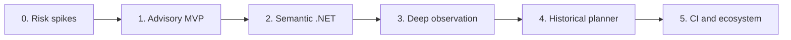

# Roadmap

Status: Schema 1 software delivered; repository-scale evidence remains operational  
Related: [Specification](specification.md), [implementation guide](implementation-guide.md), [language options](language-options.md)

The roadmap follows technical risk and learning value. Phases 0–5 have a working software path. Benchmark and calibration results still depend on representative repositories and complete-suite history; the implementation provides bounded metrics and chronological backtesting without inventing production evidence.

## Operating principles

- Ship the smallest explainable vertical slice before statistical pruning.
- Prove package-free .NET observation before selecting the core implementation language.
- Treat deterministic identity, reports, and adapter contracts as compatibility surfaces.
- Gather full-suite calibration evidence before enabling automatic selected-versus-full decisions.
- Add a second official language only after user demand and maintainer capacity are demonstrated.

## Phase 0: Risk spikes and decision gates

### Deliverables

- Dependency-free per-test .NET startup-hook observation for macOS and Linux.
- Stable test/member identity fixtures across .NET 6+ repositories.
- .NET 10 Native AOT prototypes covering process launch, SDK integration, native instrumentation boundary, local transactions, and target-specific packaging.
- Cold/warm index benchmarks on a representative repository.
- Draft adapter protocol, terminal report, error classes, and state schema.

### Decision gates

- Validate the accepted .NET 10 Native AOT topology and record any required managed adapter-process exception.
- Accept the startup-hook observer and record its coarse evidence boundary.
- Accept hash/identity schema version 1.
- Accept a local state technology or retain a storage abstraction with another spike.

### Exit criteria

- One observation prototype attributes runtime activity to individual tests without changing project dependencies.
- The same prototype runs on the minimum supported macOS and Linux matrix.
- Native AOT viability is supported by measured integration and packaging evidence; incompatible dependencies have documented process boundaries.
- Known unsupported runtime/test-runner cases are documented.

## Phase 1: Advisory MVP

### Deliverables

- Git baseline/candidate and PR merge-base resolution.
- Frozen working-tree snapshot identities.
- Language detection and explicit mixed-language failure.
- Capability negotiation and versioned adapter envelope.
- One-solution .NET adapter with test discovery and minimal requested-test mapping.
- File/project Merkle index and deterministic changed frontier.
- Text and JSON plan reports with reasons and unmapped warnings.
- Transactional, Git-ignored local state plus status/reset.
- CI fixture for target-versus-head analysis.

### Scope guardrails

- No probability-based omission.
- No hosted state service.
- No second official adapter.
- No multi-solution orchestration.
- No detached or parallel deep observation.

### Exit criteria

- `plan` produces repeatable requested-test lists without executing tests or modifying target projects.
- Mixed-language, missing-history, multiple-solution, and unmapped scenarios match the specification.
- A crash cannot replace the prior terminal result with partial state.
- JSON schema and adapter contract have conformance fixtures.

## Phase 2: Semantic .NET impact

### Deliverables

- Namespace/type/member stable identities and semantic hashes.
- Static containment and reverse call/reference graph.
- Conservative invalidation for solution/project/build-property changes.
- Shared-member scenarios such as Currency → Payments/Orders.
- Build-by-default execution and strict `--no-build` validation.
- Selected test execution with normalized analysis/test/policy failures.

### Exit criteria

- Member-specific and shared-member golden fixtures select the intended branches with explainable paths.
- Rename, deletion, partial types, overloads, generated inputs, and dependency cycles behave deterministically.
- Compilation failure and stale build artifacts are classified as analysis errors.
- Supported .NET 6+ fixture matrix passes on macOS and Linux.

## Phase 3: Deep serial observation

### Deliverables

- Managed startup-hook attachment chosen in ADR-0016.
- Serial per-test observation with build and adapter fingerprints.
- Complete assembly loads mapped back to assembly/project units.
- Atomic observation admission and interrupted-run recovery.
- Explicit optional `timeoutMs`; no default timeout.
- Documentation for integration-test environment ownership.

### Exit criteria

- Complete observations are attributable to one stable test identity at a time; finer-grained blind spots stay visible.
- The repository gains no package, source, or project modification.
- Failed tests, including external dependency failures, remain test outcomes.
- Partial/failed observations cannot poison published history.
- First-run cost and per-test overhead are benchmarked and disclosed.

## Phase 4: Historical and economic planner

### Deliverables

- Local and official-CI provenance tiers.
- Compatible/unmatched history diagnostics.
- Smoothed impact probability and separate confidence components.
- Runtime mean/variance and selected/full-suite savings estimates.
- Ranked discretionary candidates plus mandatory mappings.
- 30% fallback minimum saving and repository-configured alternatives.
- Explicit confidence threshold/action policies.
- Chronological backtesting against complete-suite runs.

### Exit criteria

- Selected-only missing outcomes are demonstrably treated as censored.
- Probability buckets have published calibration results.
- Reports disclose cold-start, incompatible history, and low-confidence conditions.
- Automatic selection is disabled unless the repository has an applicable risk policy.
- Backtests report failing-test recall and runtime reduction together.

## Phase 5: CI hardening and contributor ecosystem

### Deliverables

- Secure, vendor-neutral CI recipes and cache/artifact conventions.
- Reference remote `StateStore` contract with authenticated atomic publication.
- Stable adapter SDK/protocol and public conformance suite.
- Signed/self-contained release packaging for supported macOS/Linux architectures.
- Untrusted-fork credential guidance.
- A recorded decision to defer a Go adapter, detached observation, and parallel observation.

### Exit criteria

- A team can operate Merkle using only its own CI and storage.
- Third-party minimal adapters can pass the contract suite without linking to core internals.
- Reports clearly identify third-party producer, version, and capabilities.
- Release installation does not require adding dependencies to analyzed repositories.

## Deferred backlog

- More than one .NET solution.
- Native Windows support.
- Parallel deep per-test observation.
- Detached local observation.
- Historyless/snapshot-manifest repositories.
- Automated repository dependency provisioning.
- First-party Go adapter.
- Cross-repository impact graphs.
- A hosted Merkle service.

Each deferred item needs a demand signal, risk analysis, and explicit ADR before it enters a phase.

## Measures of progress

| Measure | Why it matters |
|---|---|
| Failing-test recall on chronological full-suite runs | Measures missed failures alongside the tests selected |
| Selected/full runtime ratio | Measures the actual feedback-loop benefit |
| Probability calibration by bucket | Detects overconfident ranking |
| High-probability/low-confidence error rate | Ensures probability and evidence quality stay distinct |
| Warm analysis work versus invalidated units | Validates incremental behavior |
| First deep-run overhead | Makes cold-start cost explicit |
| Compatible/unmatched history ratio | Shows when historical evidence applies |
| State growth per run/test/unit | Prevents a local assistant from becoming operationally expensive |
| Crash-recovery and deterministic replay rate | Protects parallel developer/agent workflows |

Do not publish an absolute latency promise until representative benchmarks exist. Gate progress on two reported numbers: runtime reduction and the empirical miss rate accepted by the repository owner.
