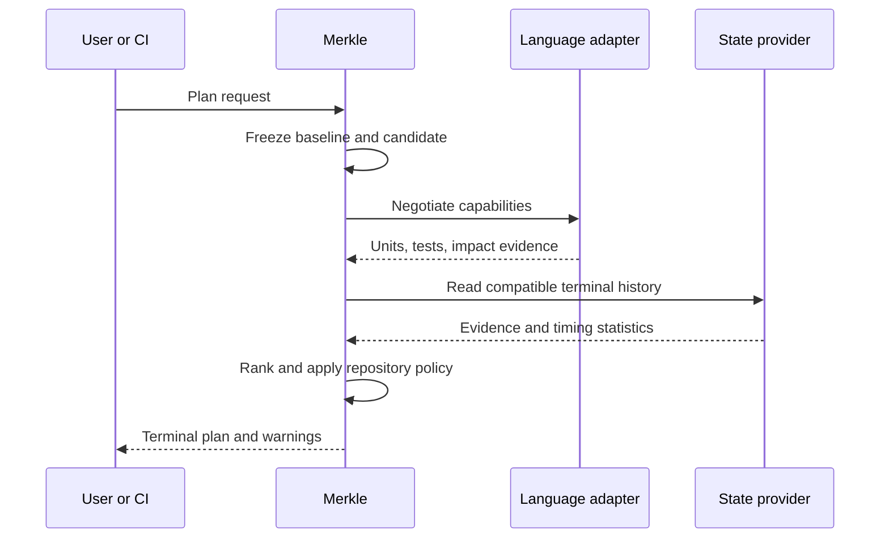

# Product specification

Status: Adopted schema 1 specification  
Applies to: Initial Merkle CLI and official .NET and Go adapters

Related: [System design](system-design.md), [domain context](../CONTEXT.md), [implementation guide](implementation-guide.md)

The words **must**, **should**, and **may** are normative. **Accepted**, **Proposed**, and **Deferred** labels keep suggestions from becoming accidental guarantees.

## 1. Product contract

Merkle accepts a baseline snapshot, candidate snapshot, language selections, available evidence, and repository policy. It returns a terminal, explainable test plan. Executing that plan does not strengthen its guarantee.

**Accepted:** Merkle is advisory. It must not state or imply that omitted tests cannot fail, that mapped tests prove coverage completeness, or that a selected plan replaces the repository's full regression suite.



## 2. Supported initial scope

| Area | Status | Requirement |
|---|---|---|
| Repository history | Accepted | Git history is required for initial baseline/candidate comparison. |
| PR default | Accepted | Compare the target merge base with PR head. |
| Local comparison | Accepted | Permit explicit/configured branch, commit, or frozen working-tree candidates. |
| Languages | Accepted | Mixed-language repositories require explicit selections and list detections when missing. |
| Official adapter | Accepted | Provide a deep adapter for .NET 6+. |
| Go adapter | Accepted | First-party deep adapter; canonical language identifier is `golang`, with `go` accepted as a CLI alias. |
| Analysis scope | Accepted | Resolve one .NET solution or Go repository/workspace scope per deep run; ambiguity is an error. |
| Operating systems | Accepted | Support macOS and Linux; WSL is best-effort; native Windows is out of scope. |
| State service | Accepted | No hosted service is provided. Team-owned remote storage is optional. |
| Implementation language | Accepted | Build the core in C# on .NET 10; managed executables default to Native AOT publishing. |

## 3. Snapshot and change requirements

- **S-001:** A run must bind immutable baseline and candidate identities before indexing or execution.
- **S-002:** A working-tree candidate must include a digest of all included dirty and untracked inputs.
- **S-003:** In recognized PR context, absent explicit refs, the baseline must be the target merge base and the candidate the PR head.
- **S-004:** In local context, refs must be supplied by CLI/configuration unless an unambiguous local policy is configured.
- **S-005:** Missing shallow-clone history or merge base is an analysis error with a remediation message.
- **S-006:** Repositories without usable Git ancestry are unsupported initially. A manually written change description is not equivalent evidence.
- **S-007:** A changed configuration or build input that can alter a complete project must invalidate at least that project scope.
- **S-008:** Merkle comparison must be deterministic for identical inputs, adapter versions, and configuration.

## 4. Language and adapter requirements

- **A-001:** Language detection must return every detected language and its evidence.
- **A-002:** When more than one language is detected and no explicit/configured selection exists, analysis must fail and list the detections.
- **A-003:** Each selected adapter must advertise a protocol version, identity version, and supported capabilities before work begins.
- **A-004:** Requesting an unavailable capability must fail with a machine code and the human message `Function not available for: <language>` or an equivalent localized form.
- **A-005:** Minimal adapters must map changed source units to stable requested-test identities and reasons.
- **A-006:** Deep adapters may additionally discover, observe, execute, and report tests.
- **A-007:** The core project does not guarantee a third-party adapter. Reports must identify its producer and version.
- **A-008:** An adapter must not silently emulate an unsupported deep capability with a weaker operation.

See [Adapter authoring](adapter-authoring.md) for protocol 1.0.

## 5. Index and impact requirements

- **I-001:** The index must separate change detection from test-impact evidence.
- **I-002:** Merkle nodes must use canonical identities, canonical child ordering, domain-separated encoding, and an identified hash scheme version.
- **I-003:** Comparing compatible roots must descend only unequal branches and return a change frontier at the available adapter granularity.
- **I-004:** The reverse impact index must distinguish containment, static dependency, dynamic observation, and historical association evidence.
- **I-005:** Cyclic dependency groups must terminate safely and produce deterministic candidate ordering.
- **I-006:** Exact member-level evidence should outrank containing-file or project fallback evidence.
- **I-007:** If deep mapping is unavailable, the engine may expand to the smallest semantic ancestor with mapped tests.
- **I-008:** Every requested test must include at least one explainable path from a changed source unit or an explicit configured rule.
- **I-009:** A changed source unit with no known test relationship must be emitted as unmapped. It must not be described as safe or untested.

## 6. .NET deep adapter requirements

- **D-001:** The official adapter must support repositories targeting .NET 6 or later within its published compatibility matrix.
- **D-002:** It must use the system `dotnet` resolver and honor normal repository SDK selection, including `global.json` behavior.
- **D-003:** It must not add a NuGet package, Node dependency, source file, project reference, or other instrumentation dependency to the target repository.
- **D-004:** It must resolve one configured or unambiguous solution. Multiple candidates are a configuration error.
- **D-005:** It must build by default.
- **D-006:** `--no-build` must prove compatible artifacts exist for the candidate snapshot and effective build configuration. Missing, stale, or incompatible artifacts are an analysis error.
- **D-007:** A build or compilation failure is an analysis error, not a test failure.
- **D-008:** Initial per-test deep observation must execute serially for unambiguous attribution.
- **D-009:** Each observation must be tied to a test identity, source-unit identity, build fingerprint, adapter version, and terminal run.
- **D-010:** A test failure caused by an external dependency is an ordinary test failure. Environment provisioning is outside Merkle.
- **D-011:** No timeout is imposed unless `--timeout-ms` or `timeoutMs` is explicitly configured.
- **D-012:** Crossing an expected runtime mean alone must not stop, fail, or broaden a run.

## 6a. Go deep adapter requirements

- **G-001:** The official adapter must require Go 1.22 or newer for source builds and invoke the repository's system `go` toolchain.
- **G-002:** The worker must use the versioned process protocol for `detect`, `index`, and `map`; the host must provide build, discovery, execution, and observation operations.
- **G-003:** Build and discovery must support `go.mod`, nested modules, and `go.work` module scopes with deterministic selection and explicit ambiguity errors.
- **G-004:** Go source and test identities must be deterministic and use the canonical `golang` namespace.
- **G-005:** No-build validation must reject missing, stale, or incompatible manifests and artifacts.
- **G-006:** Observation must preserve immutable snapshot/fingerprint boundaries and disclose runtime-only subtests, file-level coverage, standard-library coverage, reflection/dynamic behavior, generated code, plugins, subprocesses, cgo/native code, and build-tag limits.

ADR-0016 selects a managed startup hook. Observation is complete only at assembly/project granularity and must report the member, reflection, native, child-process, pre-hook-load, and identity-correlation blind spots.

## 7. Historical and statistical requirements

- **H-001:** Only terminal runs may contribute historical evidence.
- **H-002:** Official CI and local samples must retain separate provenance.
- **H-003:** Remote history admission must be explicitly configured; local runs are not automatically promoted to official history.
- **H-004:** Compatibility must consider repository identity, schema, adapter, source-unit identity, test identity, and build fingerprint family.
- **H-005:** Unmatched samples must be counted and excluded, not coerced into the current model.
- **H-006:** A cold or incompatible remote store must warn with compatible and unmatched run counts.
- **H-007:** An unexecuted test in a selected-only run is censored data, not a negative relevance label.
- **H-008:** Impact probability and evidence confidence must be separate output fields.
- **H-009:** Runtime estimates must use comparable environments and disclose when a full-suite estimate is unavailable.
- **H-010:** A periodic full-suite run remains externally owned and is the preferred calibration source.

Schema 1 uses a beta-binomial estimate for each candidate test:

```text
p(A | C,t) = (positiveRuns + 1) / (eligibleRuns + 2)
```

`A` means “test `t` is relevant to change event `C`.” Confidence is separate and combines maturity, recency, provenance, candidate coverage, and compatibility coverage. Each run contributes at most one relevance label and one timing sample.

## 8. Planning and policy requirements

- **P-001:** Exact mandatory mappings must not be removed solely because a test is slow.
- **P-002:** Discretionary candidates may be ranked by impact probability, configured severity, novelty, and expected duration.
- **P-003:** The plan must estimate selected duration and comparable full-suite duration when evidence permits.
- **P-004:** The fallback `minSavingsPercent` is 30 when not configured and when comparable timing exists.
- **P-005:** Users may lower the saving threshold, including to a 10–20% margin.
- **P-006:** There is no universal confidence threshold or default low-confidence action.
- **P-007:** A repository that asks Merkle to choose automatically must configure the applicable confidence action.
- **P-008:** Without an automatic-choice policy, the tool returns a successful ranked plan with recommendation `decision-not-configured`; `run` does not execute it.
- **P-009:** Unmapped source warns and continues by default; pedantic policy converts it to a policy failure.
- **P-010:** The report must preserve candidates excluded by budget and explain the exclusion.

## 9. CLI contract

```text
merkle plan [--base <ref>] [--head <ref|WORKTREE>]
            --languages <language:profile,...>
            [--format text|json] [--pedantic]

merkle observe --languages dotnet:deep
               [--base <ref>] [--head <ref|WORKTREE>]
               [--no-build] [--timeout-ms <milliseconds>]

merkle run [plan options] [--no-build] [--timeout-ms <milliseconds>]

merkle state status
merkle state reset --local
merkle history import <terminal-report>
```

- `plan` must never execute tests.
- `observe` builds/discovers and gathers deep per-test evidence.
- `run` plans, builds by default, and executes the policy-approved selection.
- Command-line values override repository configuration for one run.
- A possible `--dry-run=<base-ref>` alias may expand to `plan --base <base-ref> --head WORKTREE`; the alias is **Proposed**, not accepted.

## 10. Configuration contract

The recommended reviewed file is `.merkle.yml`; runtime state is separate and ignored.

```yaml
schemaVersion: 1
repository:
  solution: Example.sln
  stateDirectory: .merkle
languages:
  dotnet:
    profile: deep
baseline:
  localRef: development
  prStrategy: merge-base
execution:
  build: true
  serialObservation: true
policy:
  minSavingsPercent: 30
  confidenceThreshold: null
  onLowConfidence: null
  unmapped: warn
history:
  provider: local
```

Unknown and duplicate fields fail validation so a misspelled safety policy cannot be ignored. Schema evolution must be versioned.

## 11. Terminal report contract

Text output must remain understandable without color. JSON must be versioned from its first release. A report must include:

```text
schemaVersion
runId, terminalStatus, errorClass?, errorCode?
baseline, candidate, repositoryIdentity
languages[], adapters[], capabilities[]
indexSchema, identitySchemas[], buildFingerprint?
changedUnits[] { identity, kind, changeKind, mapped }
tests[] {
  identity, displayName, selected,
  impactProbability, evidenceConfidence,
  expectedDurationMs?, reasons[], excludedBy?
}
unmappedUnits[], warnings[]
history { compatibleRuns, unmatchedRuns, provenanceTiers }
economics { selectedMeanMs?, fullMeanMs?, savingsPercent? }
policy { effectiveConfiguration, recommendation, decisiveReason }
```

The terminal report must redact secrets and bound persisted output. It should include enough version and evidence-cutoff information to explain a later replay difference.

## 12. Failure classification

| Class | Examples | Result |
|---|---|---|
| Configuration error | Mixed languages not selected, multiple solutions, invalid policy | No evidence admitted; actionable configuration message |
| Capability error | Deep operation requested from minimal adapter | Named language and missing capability |
| Analysis error | Missing merge base, build failure, stale `--no-build`, corrupt index | Failed terminal report; not a test failure |
| Test failure | Assertion, crash, explicit timeout, external dependency failure | Completed execution report with failed test |
| Policy failure | Pedantic unmapped unit, configured confidence gate | Complete plan plus decisive policy reason |
| Interrupted | Signal, runner loss, process crash | Recoverable journal; prior published state remains current |

Exit codes are 0 success, 2 configuration, 3 capability, 4 analysis/build, 5 test failure, 6 policy, and 130 interruption. Machine-readable reports retain the error class and code.

## 13. State and visibility requirements

- Local runtime state must live in an explicitly resolved repository subdirectory and should be Git-ignored.
- Merkle may warn that state is tracked/unignored but must not silently edit `.gitignore`.
- In-progress work must use isolated run journals.
- Other agents and processes must see the previous complete result until a new run reaches a terminal state.
- Successful and failed terminal reports must become visible atomically.
- Invalid partial evidence must not enter historical statistics.
- `state status` must identify provider, version, last compatible run, size, and rebuild need.
- `state reset --local` must validate its exact target and affect only local disposable state.
- Teams may implement remote storage, but the project provides no hosted infrastructure.

SQLite schema 2 is the accepted local provider behind the storage interfaces.

## 14. Security and privacy requirements

- Merkle must treat builds/tests as arbitrary code execution and must not claim to sandbox them.
- No data may leave the runner without an explicitly configured remote provider.
- History should store identities, hashes, provenance, aggregate statistics, and bounded/redacted outcomes rather than source content.
- Official remote writes must be authenticated; untrusted PRs should use read-only or isolated credentials.
- Environment values, tokens, connection strings, and configured secret patterns must be redacted from persistent reports.
- Adapter input/output must be bounded and validated.
- Third-party adapters must not be automatically installed or treated as trusted solely because a repository requests one.

## 15. Initial acceptance scenarios

1. **Member-specific shared code:** a change to a Currency member used only by Payments selects direct Currency/Payments tests but not unrelated Orders tests; reasons show the path.
2. **Shared member:** a change to a Currency member used by Payments and Orders reaches both branches.
3. **Mixed repository:** detection without `--languages` fails and lists every language; explicit selections proceed only with available capabilities.
4. **Unmapped source:** normal plan warns and continues; pedantic plan returns policy failure.
5. **Default build:** a valid .NET solution builds before deep execution.
6. **Compilation error:** the terminal report classifies it as analysis failure.
7. **No-build:** absent or incompatible artifacts cause analysis failure; compatible artifacts proceed.
8. **No timeout:** a slow test is not cancelled merely for exceeding its mean; an explicit timeout is enforced.
9. **External dependency:** a test's database/network failure is reported as a test failure.
10. **Cold server:** report gives compatible/unmatched history counts and weaker confidence.
11. **Concurrent agents:** a reader never observes another run's partial index or result.
12. **Economics:** a plan with less than configured savings recommends the full suite or follows the repository's explicit action.
13. **Censored history:** omitted tests from selected-only runs are not learned as negative labels.
14. **Advisory language:** text and JSON communicate limitations and never describe omissions as proven safe.
