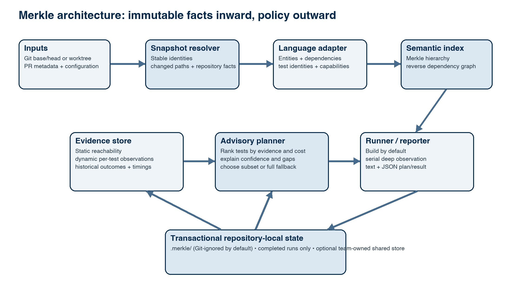
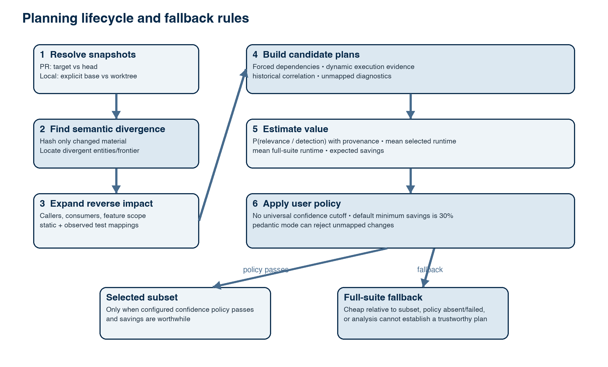

# Merkle Test Impact Analyzer: Architecture Package

Status: Implemented schema 1 design  
Working name: **Merkle**  
Scope: Advisory test-impact analysis for Git repositories, with a first-party deep adapter for .NET 6+  
Primary environments: macOS and Linux; WSL is best-effort; native Windows is out of scope

The accepted core toolchain is C# on .NET 10. First-party managed executables are developed and continuously verified for Native AOT publication. Reflection-heavy SDK integration and dynamically loaded tooling must stay behind explicit module or process boundaries; an exception to AOT requires its own recorded decision.

<!-- DOCX_BODY -->

## 1. Executive summary

Merkle is a self-hosted CLI that compares two repository snapshots and identifies the tests most relevant to their differences. It shortens the feedback loop for developers and parallel coding agents without replacing a full regression suite.

The engine combines four kinds of evidence:

1. a deterministic Merkle index that finds changed repository and semantic units quickly;
2. a reverse dependency index that traces those units toward dependent code and tests;
3. per-test runtime observations that record which semantic units each test exercised; and
4. historical correlations between change sets, selected tests, runtimes, and outcomes.

Merkle returns an explainable, ranked test plan. A team may execute that plan when its configured confidence and savings policies allow it, or consume the plan as plain text/JSON in another system. Merkle is a loose-strength, advisory tool. Teams should still run a periodic full suite, such as a nightly build, through their existing CI/CD system.

Merkle ships without a hosted service. The CLI writes restartable state beneath the repository by default, and that state should be ignored by Git. Teams may configure their own object storage, cache, network filesystem, or server-backed state provider for CI history. The project does not provision or sell infrastructure.

The first official deep adapter targets .NET 6 and later. It builds by default, discovers tests, observes tests serially for reliable attribution, maps changed symbols to tests, runs selected tests, and reports results. It must not require a NuGet package or other dependency to be installed in the repository under analysis. TypeScript is explicitly removed from the first-party scope. Go is a possible later official adapter, but is not committed.

## 2. Product position and differential

Most test selectors start from one evidence source: file paths, manually maintained ownership rules, static dependency graphs, code coverage, or historical co-failure. Merkle combines all four evidence families behind an adapter boundary:

- **Incremental Merkle descent.** Once two snapshot indexes exist, equal hashes prune unchanged branches. The engine descends only mismatched branches.
- **Semantic leaves.** The .NET adapter can represent namespaces, types, and members. A change to `Currency.X` can select tests for `Currency.X` and Payments without automatically selecting Orders; a change to shared `Currency.Y` can select Currency, Payments, and Orders.
- **Reverse impact traversal.** The engine records containment and dependency edges in the direction needed by impact queries: changed unit to dependents and relevant tests.
- **Dynamic per-test attribution.** Deep observation distinguishes code colocated in a file from code executed by a particular test.
- **Historical, probability-based ranking.** When exact observation is absent or incomplete, prior runs strengthen or weaken candidates while preserving uncertainty.
- **Economic planning.** Expected test runtimes are part of selection. If the selected plan is not materially cheaper than the full suite, the result can recommend the full suite instead.
- **Capability-negotiated adapters.** Contributors can implement the minimal capability (listing tests requested for changed code), then add deep discovery, observation, execution, and reporting later.
- **No source-project package requirement.** Official observation is launched externally by the CLI.
- **Explainability.** Every selected test carries reasons, evidence provenance, probability, confidence, and expected duration.

An unselected test may still fail. Merkle produces a better-informed, auditable selection than path rules alone.

## 3. Goals and non-goals

### 3.1 Goals

- Compare a PR head to its target branch by default and identify changed source units.
- Support local comparisons between a working tree, branch, commit, or merge base.
- Return a minimal, stable, consumable list of affected tests.
- Support .NET 6+ deeply without changing the repository's project dependencies.
- Learn exact per-test execution relationships and statistical historical relationships.
- Rank tests by estimated impact probability, evidence confidence, and mean duration.
- Let users choose the risk policy and expose weak evidence without claiming safety.
- Store local state transactionally in a restartable, Git-ignored directory.
- Allow user-provided remote storage for CI history without requiring a Merkle-hosted service.
- Allow third parties to add adapters without coupling language-specific logic to the engine.
- Operate on macOS and Linux and work under WSL when the Linux prerequisites are present.

### 3.2 Non-goals

- Guarantee that the selected set is equivalent to the full suite.
- Replace nightly, release, compliance, coverage, or security test gates.
- Infer adequate test coverage for source code that has no mapped tests.
- Provision a cloud service or prescribe a specific CI vendor.
- Orchestrate databases, browsers, containers, or other integration-test dependencies.
- Diagnose external test dependencies; a failed dependency is reported as an ordinary test failure.
- Support repositories without usable Git history in the initial version.
- Support more than one .NET solution in the initial version.
- Support native Windows in the initial version.
- Guarantee compatibility or correctness for third-party adapters.
- Ship TypeScript as a first-party adapter.
- Run deep per-test observation concurrently in the initial version.

## 4. Domain model and ubiquitous language

### 4.1 Core terms

| Term | Precise meaning |
|---|---|
| Repository | The Git work tree and configuration placed in scope for one analysis. |
| Snapshot | An immutable view of repository inputs identified by Git object IDs plus a working-tree digest when applicable. |
| Baseline | The snapshot against which a candidate snapshot is compared; normally the PR target or merge base. |
| Candidate | The head commit, branch, or working tree being evaluated. |
| Unit | The smallest addressable item known to an adapter: file at minimum; namespace, type, or member for deep .NET analysis. |
| Stable unit ID | Adapter-defined canonical identity used to compare equivalent units across snapshots. |
| Merkle node | A deterministic hash over a unit or ordered collection of child identities and hashes. |
| Changed frontier | The smallest set of unequal Merkle branches or leaves sufficient to explain a snapshot difference. |
| Containment edge | A structural relationship such as repository contains project, project contains type, or type contains member. |
| Dependency edge | A static or observed relationship in which one unit can affect another. |
| Reverse impact index | An index optimized for traversing from a changed unit to its dependents and test candidates. |
| Test identity | A stable adapter-defined ID for a discoverable test, independent of display formatting. |
| Observation | Evidence that a particular test execution reached a particular unit in a particular build. |
| Historical sample | A completed run containing provenance, changes, selected/executed tests, runtimes, and outcomes. |
| Official run | A sample admitted through an explicitly configured CI or trusted remote ingestion path. |
| Local run | A looser sample produced from a developer work tree; useful locally but not automatically trusted as official history. |
| Evidence | A static edge, dynamic observation, historical association, or configured rule supporting a test candidate. |
| Impact probability | The estimator's `p(A)` that a test is relevant to the supplied change event, conditional on available evidence. |
| Confidence | A separate measure of how complete, compatible, numerous, and recent the evidence supporting the probability is. |
| Expected duration | The arithmetic runtime mean of compatible executed samples, maintained with Welford's online algorithm. |
| Test plan | A ranked set of tests plus reasons, probabilities, confidence, expected duration, exclusions, and warnings. |
| Capability | An operation an adapter advertises: detect, index, discover, map, observe, execute, or report. |
| Minimal adapter | An adapter able to turn changed units into a requested-test list. |
| Deep adapter | An adapter that also discovers, observes, executes, and reports tests. |
| State publication | The atomic act of making a completed or failed run visible as the latest result. |

### 4.2 Terms that must stay separate

- A **hash difference** says content or structure changed; it does not say what tests are affected.
- A **dependency edge** says impact is possible; an **observation** says execution occurred in a recorded run.
- A high **impact probability** is not necessarily high **confidence**. One can have a high estimate based on very little data.
- **Requested tests** are the adapter's candidates; the **test plan** is the engine's ranked and policy-filtered result.
- **Unmapped** means no known test relationship; it does not mean untested or safe.
- A **test failure** is a product/test outcome. An **analysis error** means Merkle could not construct or evaluate the requested analysis.

## 5. Architecture principles

1. **Snapshot first.** Every operation binds to immutable baseline and candidate identities before expensive work begins.
2. **Deterministic core.** The same snapshots, configuration, adapter versions, and state evidence produce the same plan.
3. **Evidence is append-only; publication is atomic.** Partial runs never become the current trusted result.
4. **Language behavior remains behind an adapter protocol.** Core planning must not contain .NET symbol or runner semantics.
5. **Expose one deep facade, hide mechanics.** Callers ask for an impact plan, not for tree traversal, SQL queries, or runtime-observer events.
6. **Advisory by construction.** Reports state what is known, unknown, selected, and excluded.
7. **No surprise mutation.** The CLI does not edit solution, project, package, or `.gitignore` files without an explicit command.
8. **Capability before command.** Unsupported adapter operations fail clearly instead of degrading invisibly.
9. **Economic selection is policy, not evidence.** Runtime savings never increase the estimated chance that a test is relevant.
10. **Local and official history retain provenance.** Trust tiers are never merged without an explicit policy.

## 6. System context

The CLI is the only required entry point. CI vendors invoke the same executable and pass repository refs and language capabilities explicitly. A remote state provider is optional and team-owned.



> Figure 1. The semantic Merkle hierarchy detects change cheaply; the reverse graph and evidence store determine test impact. Those are separate responsibilities.

## 7. Deep module seams

These interfaces define language- and ABI-neutral responsibility boundaries.

### 7.1 Public engine facade

```text
ImpactEngine.plan(PlanRequest) -> PlanResult
ImpactEngine.observe(ObserveRequest) -> ObserveResult
ImpactEngine.run(RunRequest) -> RunResult
ImpactEngine.reset(ResetRequest) -> ResetResult
```

The facade owns orchestration, consistency checks, error classification, and atomic publication. Its four operations hide the low-level tree and storage APIs.

### 7.2 SnapshotSource

Resolves baseline and candidate references, merge bases, changed paths, repository metadata, and immutable snapshot IDs. Initial implementation: Git only.

```text
resolve(SnapshotSpec) -> Snapshot
diff(BaselineSnapshot, CandidateSnapshot) -> ChangedPathSet
read(Snapshot, Path) -> ByteStream
```

It hides Git command syntax, CI environment variables, shallow-clone repair diagnostics, and working-tree normalization.

### 7.3 LanguageDetector and AdapterRegistry

`LanguageDetector` returns all detected languages and evidence. `AdapterRegistry` resolves the explicitly requested `language:profile` pairs and negotiates capabilities.

```text
detect(Snapshot) -> DetectedLanguage[]
resolve(LanguageSelection[]) -> AdapterSession[]
```

If multiple languages are detected and neither configuration nor command line selects the expected languages, planning fails and lists all detections. The engine must not guess which language is authoritative.

### 7.4 LanguageAdapter

```text
describe() -> AdapterDescriptor
index(IndexRequest) -> UnitGraphFragment
discover(DiscoverRequest) -> TestCatalog
map(MapRequest) -> RequestedTestSet
observe(ObserveRequest) -> ObservationBatch
execute(ExecuteRequest) -> TestExecutionBatch
```

Each operation is gated by an advertised capability. A minimal adapter needs `index` or changed-file intake plus `map`, and must return test identities and reasons. A deep adapter adds discovery, observation, execution, and reporting. Requesting an unsupported operation returns `CapabilityUnavailable(language, capability)` and a non-zero exit code.

The adapter boundary should be process-capable even if the official .NET adapter initially runs in process. A versioned request/response protocol prevents future adapters from inheriting the core implementation language or runtime.

### 7.5 MerkleIndex

Constructs and compares canonical Merkle DAGs. It owns hashing, domain separation, child ordering, incremental replacement, and root verification. It does not know test-selection policy.

### 7.6 ImpactIndex

Stores containment, static dependency, dynamic observation, and historical association edges optimized for reverse traversal. It accepts graph fragments from adapters and returns candidate evidence paths without exposing storage queries.

### 7.7 HistoryModel

Admits compatible completed samples, maintains sufficient statistics, performs decay and calibration, and emits impact probability plus confidence components. It never decides whether the plan should run.

### 7.8 PlanPolicy

Combines mandatory candidates, ranked candidates, runtime estimates, confidence requirements, savings requirements, and user policy into a plan or a policy error. It cannot manufacture evidence.

### 7.9 TestExecutor

Builds by default through the adapter, validates reusable artifacts under `--no-build`, executes tests, enforces an explicitly configured timeout, and normalizes outcomes. The first .NET implementation observes tests serially.

### 7.10 StateStore

Provides transactional snapshots, evidence queries, run journals, schema migration, and atomic publication. Implementations may be local or team-provided remote stores. SQL/file/object-store details do not leak into the engine.

### 7.11 ReportSink

Renders stable text and versioned JSON. Optional CI annotations are sinks layered over the canonical result, not changes to planning semantics.

## 8. Merkle and reverse-index model

### 8.1 Canonical unit hierarchy

At minimum, the tree is repository → language root → project/module → path → file. A deep .NET adapter enriches it with project → namespace → type → member. A file remains the fallback unit for code the semantic analyzer cannot model.

Children are sorted by their canonical stable IDs. Hash input uses length-delimited, domain-separated encoding; it must never rely on ambiguous string concatenation.

Conceptually:

```text
leafHash = H("merkle/unit/v1", kind, stableId, normalizedContentHash, semanticSignature)
nodeHash = H("merkle/node/v1", kind, stableId, sorted(childStableId, childHash)[])
```

The initial portable recommendation is SHA-256 because it exists in standard runtimes and provides negligible accidental-collision risk. A faster algorithm can be evaluated later only with an index schema/version change or an explicit algorithm identifier.

### 8.2 Building and updating

The first index reads all included repository inputs. Subsequent indexes begin with the Git path delta, reparse only changed inputs, and recompute their ancestors. A full verification mode may rescan all inputs and compare the resulting root.

Inputs that can alter semantic meaning (solution and project files, central package properties, compiler configuration, generated-source inputs, and build props/targets) must be represented as dependency roots. Changing one may conservatively invalidate a project or solution subtree.

### 8.3 Finding the change frontier

Given indexed baseline and candidate roots:

1. If the root hashes are equal, the semantic input set is unchanged.
2. For unequal roots, compare ordered children.
3. Stop descending at added/deleted leaves or at the configured semantic granularity.
4. Emit changed units with change kind and nearest unchanged/changed containment ancestors.

Unequal parent hashes direct descent to unequal branches. Cryptographic collisions do not locate changes.

### 8.4 Building the reverse impact index

For each semantic snapshot, adapters emit:

- `contains(parent, child)`;
- `dependsOn(consumer, provider)` from static analysis;
- `testContains(test, testMember)`;
- `observed(test, unit, buildFingerprint)` from deep runs; and
- historical sufficient statistics keyed by stable unit/test identities and compatible fingerprints.

The index stores dependency edges in both their natural and reverse direction or materializes the reverse query efficiently. Starting at each changed unit, the engine walks dependents until it reaches tests or configured boundaries. Cycles are condensed into strongly connected components before traversal.

### 8.5 Scope frontier and shared code

Containment is a fallback for incomplete mappings, not the sole definition of impact. Candidate construction proceeds in this order:

1. exact observed tests for the changed unit;
2. tests reached through static reverse dependencies;
3. historically associated tests;
4. tests mapped to the smallest covering semantic ancestor when deeper evidence is absent;
5. optionally, broader project/solution tests under a configured conservative policy.

Example:

- `Currency.X` is called only by Payments. A change selects tests directly observing `Currency.X`, Currency tests mapped to `X`, and Payments tests reached through the caller graph.
- `Currency.Y` is called by Payments and Orders. A change reaches both branches and their mapped tests.
- An assembly-level build-property change invalidates the containing project because a member-level frontier would be misleading.

Containment remains a fallback, so an incomplete semantic graph can expand conservatively without treating directory co-location as proof.

## 9. Dynamic per-test observation

### 9.1 .NET deep adapter behavior

The official adapter targets projects whose target frameworks are .NET 6 or later. It uses the system `dotnet` installation and honors normal SDK resolution, including repository `global.json` behavior. If the required SDK is unavailable, analysis fails with the resolver diagnostics. It does not add a NuGet package to test or production projects.

Default flow:

1. resolve exactly one solution;
2. invoke a normal build;
3. capture a build fingerprint from solution inputs, SDK/runtime, compiler options, assembly identities, and adapter version;
4. discover stable test identities;
5. execute each test serially in observation mode;
6. attach the managed startup hook and collect assemblies loaded by that test process;
7. map complete assembly observations back to project and assembly unit IDs;
8. publish observations and outcomes atomically.

ADR-0016 selects a managed `DOTNET_STARTUP_HOOKS` observer. It provides assembly/project evidence, not member-level coverage. Reflection-only resolution, native code, child processes, assemblies loaded before the hook, and unmatched runner identities remain explicit blind spots. External attachment does not change packages or source in the target repository.

### 9.2 Serial attribution

Deep observation is serial in the initial version. Serial execution keeps the mapping from runtime activity to test identity unambiguous and simplifies isolation, retries, and crash recovery. Parallel observation requires proof that process and async attribution remain accurate and is deferred.

### 9.3 Build controls

- Build is enabled by default.
- `--no-build` reuses an available compatible build only.
- If no artifacts exist, or their fingerprint is incompatible with the requested snapshot/configuration, `--no-build` is an analysis error.
- A compilation failure is an analysis error, not a failed test.
- Merkle does not automatically choose a behavior merely because observed runtime exceeds its expected mean.
- `--timeout-ms <n>` adds an explicit execution timeout. Without it, Merkle sets no timeout.

### 9.4 Integration tests

Test environment provisioning remains outside Merkle. If a selected integration test cannot connect to a dependency, its runner outcome is reported as an ordinary test failure. Repositories may exclude or tag tests through adapter/runner configuration; Merkle does not invent special dependency-failure semantics.

## 10. Historical correlation and statistical planning

### 10.1 Admitted samples

A sample is eligible only after a run reaches a terminal state and its provenance is known. Compatibility checks include repository identity, schema, adapter version, unit identity version, build fingerprint family, and test identity version. Incompatible or unmatched samples are counted and excluded.

If a configured server has little or no matching history, the CLI warns with concrete counts, for example: “3 compatible runs; 17 stored runs could not be matched to the current codebase.” The warning explains that early recommendations are weaker and should improve as compatible runs accumulate.

Official CI samples and local samples have separate provenance. A default remote history implementation should admit only explicitly configured official CI requests. Local samples remain usable for the local repository unless a user explicitly imports or promotes them.

### 10.2 Events and sufficient statistics

For a changed unit or change cluster `C` and test `t`, define event `A(t,C)` as “test `t` is relevant to change event `C`,” evidenced by one or more of:

- a complete assembly/project observation path;
- a static dependency path;
- test failure/change association in a calibration run;
- repeated selection and useful outcome under comparable changes.

The history store should omit raw source content and retain these sufficient statistics:

- compatible exposures of unit/cluster `C`;
- runs in which `t` was executed for `C`;
- positive relevance labels and their provenance;
- failures, passes, skips, and flaky transitions;
- observation counts and last-seen timestamps;
- runtime samples with Welford mean and sample variance;
- full-suite calibration runs versus selected-only runs.

Selected-only data is censored: an unexecuted test is not a negative label. The estimator must not learn “safe to omit” from absence alone.

### 10.3 Probability estimate

Schema 1 uses an inspectable beta-binomial estimate per candidate test:

```text
p(A | C,t) = (positiveRuns + 1) / (eligibleRuns + 2)
```

One compatible run contributes at most one label, which caps duplicate correlation. A label is positive when the test failed, timed out, crashed, or completely observed a changed unit. Selected-only omissions are censored.

### 10.4 Confidence is separate

Confidence multiplies sample maturity, 30-day recency decay, provenance weight, candidate coverage, and compatibility coverage. Reports keep the numeric probability and numeric evidence confidence in separate fields.

### 10.5 Mean runtime and plan economics

For each test, maintain an arithmetic mean and sample variance within compatible execution environments using Welford's algorithm. Estimate serial plan cost from test means. Estimate the full-suite cost from comparable full runs; if unavailable, mark savings unknown.

Candidate priority may be expressed as expected relevance captured per unit time:

```text
priority(t) = p(A | C,t) * severityWeight(t) * noveltyWeight(t) / max(meanRuntime(t), epsilon)
```

Exact mandatory mappings remain selected regardless of that ratio. The ratio ranks discretionary candidates under a user-defined budget; it does not redefine relevance.

The default economic fallback, when comparable timing evidence exists and the user has not configured another value, is a 30% minimum estimated improvement over the full suite. Teams that value a 10–20% margin can lower `minSavingsPercent`. Exceeding a historical mean triggers no action; only an explicit `timeoutMs` limits execution.

### 10.6 Policy ownership

The user owns the risk decision. Confidence thresholds and low-confidence behavior have no universal default. Configuration may choose:

- run selected tests;
- recommend or run the full suite;
- emit the plan but do not execute; or
- fail the policy gate.

If a command requires an automatic choice but the necessary confidence policy is absent, it should produce the ranked plan with an explicit “decision not configured” status. Final command semantics remain open.



> Figure 2. Savings and confidence are separate gates. The savings floor defaults to 30%; the confidence acceptance threshold has no default.

## 11. CLI proposal

CLI names remain provisional. The planned contract is:

```text
merkle plan [--base <ref>] [--head <ref|WORKTREE>]
            --languages <language:profile,...>
            [--format text|json]
            [--pedantic]

merkle observe --languages dotnet:deep
               [--base <ref>] [--head <ref|WORKTREE>]
               [--no-build]
               [--timeout-ms <milliseconds>]

merkle run [plan options]
           [--no-build]
           [--timeout-ms <milliseconds>]

merkle state status
merkle state reset [--local]
merkle history import <report>
```

`plan` is the canonical dry run and never executes tests. An alias such as `--dry-run=<base-ref>` may expand to `plan --base <base-ref> --head WORKTREE`; the `plan` subcommand remains easier to validate.

### 11.1 Baseline behavior

- In an authenticated PR CI context, default baseline is the target branch's merge base and candidate is the PR head.
- Outside a recognized PR context, baseline/head must come from configuration or command line unless an unambiguous local default is adopted later.
- A shallow checkout that lacks the merge base is an analysis error with a fetch-depth remedy.
- Local comparison may use a configured development branch, another feature branch, a commit, or the current work tree.
- A no-history repository is unsupported initially; a manually described change file is not treated as equivalent to Git ancestry.

### 11.2 Language behavior

- One detected language may use its configured adapter.
- Multiple detected languages with no explicit selection cause a configuration error that lists detections.
- Example future syntax: `--languages=dotnet:deep,golang:minimal`.
- TypeScript is not an official target.
- A third-party adapter is used at the team's discretion and carries no project guarantee.

### 11.3 Unmapped behavior

If changed code has no mapped tests, Merkle reports each unmapped unit and continues by default. `--pedantic` converts unmapped units into a policy failure. Coverage completeness remains the responsibility of existing tools such as CI coverage reports or static analysis platforms.

## 12. Configuration proposal

Suggested repository file: `.merkle.yml`. It is versioned because team policy should be reviewable. Runtime state is not versioned.

```yaml
schemaVersion: 1

repository:
  solution: Example.sln
  stateDirectory: .merkle

languages:
  dotnet:
    profile: deep
    targetFrameworkMinimum: net6.0

baseline:
  localRef: development
  prStrategy: merge-base

execution:
  build: true
  serialObservation: true
  # timeoutMs omitted: no timeout

policy:
  minSavingsPercent: 30
  # User must set these when automatic low-confidence behavior is desired.
  confidenceThreshold: null
  onLowConfidence: null
  unmapped: warn

history:
  provider: local
  trustLocal: true
  remote: null

report:
  format: text
  includeReasons: true
```

Command-line options override configuration for one run. Every report records the effective, redacted configuration.

## 13. Storage model

### 13.1 Local layout

```text
.merkle/
  state.db                 # transactional metadata/index store
  objects/                 # optional content-addressed graph or observation blobs
  runs/<run-id>/journal    # private in-progress journal
  reports/<run-id>.json    # terminal reports
  locks/                   # narrowly scoped leases
  version                  # state schema version
```

`.merkle/` should be listed in `.gitignore`. Merkle may warn when it is tracked or unignored, but should not edit `.gitignore` unless the user explicitly requests initialization that does so.

SQLite schema 2 is the accepted local store. It publishes reports, indexes, history, and the current pointer atomically behind provider interfaces. Remote history uses a separate HTTPS protocol and never exposes the local database or SQL.

### 13.2 Logical records

| Record | Key data |
|---|---|
| Repository | Canonical repository ID and identity salt |
| Snapshot | Git IDs, work-tree digest, timestamp, provenance |
| Unit | Snapshot, stable ID, kind, path, semantic fingerprint |
| Merkle node | Snapshot, stable ID, hash algorithm/version, hash, children |
| Edge | Snapshot/fingerprint, source, target, type, provenance |
| Test | Stable test ID, adapter, display name, traits |
| Observation | Test, unit, build fingerprint, run, count |
| Run | Immutable request, provenance, lifecycle state, effective config |
| Outcome | Run, test, status, duration, normalized failure metadata |
| Statistic | Unit/cluster, test, decayed counts, runtime mean/variance |
| Plan | Snapshot pair, candidates, policy, selected set, explanations |

Source text is not required in history. Store hashes, stable identifiers, paths where needed for explanations, test names, metrics, and normalized outcomes. Failure output can contain secrets and should be bounded/redacted before persistent storage.

### 13.3 Transaction and visibility model

1. Create an isolated run journal and bind it to immutable snapshot IDs.
2. Perform analysis and execution without changing the published pointer.
3. Write a terminal report for success or failure.
4. Commit all admitted observations/statistics in one transaction.
5. Atomically publish the run as current.

Other agents see the previous complete state until step 5, then the entire new result. Failed runs are visible after conclusion but must not contribute positive history unless their valid observations are explicitly admitted by policy. A crash leaves a recoverable journal that can be resumed or discarded. `merkle state reset --local` archives or removes only the named local state directory after validation.

### 13.4 Remote state

`StateStore` may be implemented over team-provided bare-metal or cloud storage. The official project defines contracts and compatibility rules but does not provision infrastructure. Remote providers must supply atomic publication or an equivalent compare-and-swap manifest, authenticated writes, encryption in transit, and provenance metadata.

## 14. CI and local lifecycles

### 14.1 Pull request lifecycle

1. CI checks out the PR head and enough target history to resolve the merge base.
2. CLI resolves target and head immutable snapshots.
3. Explicit/configured languages and capabilities are validated.
4. Compatible index/history state is restored from the team's cache/store if configured.
5. The change frontier and reverse impact candidates are computed.
6. The estimator attaches probabilities, confidence, reasons, and mean runtimes.
7. Policy yields a selected plan, a full-suite recommendation, or a configured policy failure.
8. `plan` reports only; `run` builds by default and executes the approved set.
9. Terminal results are published atomically and optionally exported as a CI artifact.
10. A separate scheduled job continues to run the full suite and may import its calibration evidence.

Official remote history is accepted only from configured CI provenance. Repository forks and untrusted PRs should receive read-only or isolated state credentials.

### 14.2 Local lifecycle

1. Developer chooses a baseline or uses configured `localRef`.
2. Candidate is a commit, branch, or a frozen digest of the current work tree.
3. CLI reads/writes Git-ignored local state.
4. A plan can be regenerated repeatedly as work changes.
5. A deep observation may first require a full serial run, after which local plans improve.
6. If local history becomes confusing or incompatible, the user can inspect it and reset local state.

A detached/background local run is deferred. If added, it must freeze the candidate snapshot before detaching and preserve the same terminal-only publication semantics.

## 15. Functional specification

| ID | Requirement |
|---|---|
| F-001 | Resolve and compare Git baseline and candidate snapshots. |
| F-002 | Default PR comparison to target merge base versus current head. |
| F-003 | Detect repository languages and fail on an unconfigured mixed repository while listing detections. |
| F-004 | Negotiate adapter profiles and fail clearly when a requested capability is unavailable. |
| F-005 | Build deterministic Merkle roots and return the changed frontier. |
| F-006 | Maintain a reverse impact index over containment, dependencies, observations, and history. |
| F-007 | Return stable affected-test identities with human-readable reasons. |
| F-008 | Report unmapped changed units and continue unless pedantic mode is active. |
| F-009 | Ship a deep .NET 6+ adapter that does not add target-project packages. |
| F-010 | Build .NET inputs by default; validate compatible artifacts for `--no-build`. |
| F-011 | Classify compilation failure as an analysis error. |
| F-012 | Discover and observe .NET tests serially in the initial implementation. |
| F-013 | Treat dependency/setup failures reported by tests as normal test failures. |
| F-014 | Apply no timeout by default and enforce only explicit `timeoutMs`. |
| F-015 | Estimate per-test impact probability and expose evidence confidence separately. |
| F-016 | Maintain comparable mean runtime and variance statistics. |
| F-017 | Rank candidates and estimate selected-plan versus full-suite duration. |
| F-018 | Default `minSavingsPercent` to 30 when comparable timing evidence exists; permit override. |
| F-019 | Leave confidence threshold and low-confidence action to explicit user policy. |
| F-020 | Warn with compatible/unmatched history counts during cold or incompatible remote history. |
| F-021 | Persist only terminal visible state and recover cleanly after interruption. |
| F-022 | Support safe local-state status and reset. |
| F-023 | Emit stable text and versioned machine-readable reports. |
| F-024 | Support exactly one .NET solution initially and error on ambiguity. |

## 16. Nonfunctional specification

| Quality | Requirement |
|---|---|
| Determinism | Canonical inputs and config must reproduce root hashes and ordering. |
| Explainability | Every selected/excluded candidate must expose decisive reasons and policy. |
| Incrementality | Warm analysis reparses changed inputs and invalidated dependents, not the entire repository without reason. |
| Crash safety | State publication is atomic; interrupted journals cannot corrupt the prior complete state. |
| Portability | Official binaries support macOS and Linux architectures chosen at release; WSL follows Linux best-effort. |
| Isolation | Official observation changes no source, project, solution, or dependency declarations. |
| Privacy | Raw source is not uploaded by the engine; remote history stores minimal evidence and redacted output. |
| Compatibility | All persisted schemas, adapter protocols, stable IDs, and report contracts are versioned. |
| Scalability | Index and planner benchmarks must report cold/warm time, memory, state growth, and graph size on representative monorepos before targets are frozen. |
| Observability | Logs carry run ID, phase, snapshot IDs, adapter, duration, and classified terminal status without secrets. |
| Accessibility | Text output remains understandable without color; reasons and warnings are plain language. |
| Security | Untrusted repository builds run with CI-provided isolation and least-privilege state credentials. |

Absolute latency targets remain repository-specific. The primary outcome metric is reduction from full-suite wall time at an accepted empirical miss rate; index throughput is a supporting metric.

## 17. Failure and exit semantics

| Class | Examples | Required behavior |
|---|---|---|
| Success | Plan generated; selected tests pass | Exit success; publish terminal report. |
| Configuration error | Mixed languages not selected; multiple solutions; invalid policy | Explain remediation; no evidence admitted. |
| Capability error | `observe` requested from a minimal adapter | `Function not available for: <language>` plus missing capability. |
| Analysis error | Git merge base unavailable; build/compilation failed; stale/missing `--no-build` artifacts; corrupt index | Preserve diagnostics, publish failed run, do not label as test failure. |
| Test failure | Assertion, crash, test timeout, or unavailable external dependency reported by runner | Normalize as failed test; publish complete test results. |
| Policy failure | Pedantic unmapped unit; configured confidence gate not met | Publish plan and decisive policy reason. |
| Interrupted | Process signal or host loss | Leave recoverable journal; never publish partial state as current. |

Schema 1 exit codes are 0 success, 2 configuration, 3 capability, 4 analysis/build, 5 test failure, 6 policy, and 130 interruption. Error class and machine code remain in the JSON contract.

## 18. Security and privacy

- Treat repository builds and tests as arbitrary code execution; Merkle does not provide a sandbox. CI must apply its normal isolation.
- Never send data to a remote provider unless it is explicitly configured.
- Minimize stored data to hashes, stable identifiers, paths needed for explanations, test metadata, aggregate statistics, and bounded outcomes.
- Redact environment values, tokens, connection strings, and configured patterns from command output and reports.
- Do not persist complete environment blocks or arbitrary test stdout by default.
- Use a repository identity salt so identical source hashes are not unnecessarily correlatable across remote tenants.
- Authenticate remote writes; give untrusted PRs no write credential or an isolated namespace.
- Sign or provenance-stamp official CI reports before history admission when the provider supports it.
- Validate adapter binaries/protocol versions and never automatically install an untrusted repository adapter.
- Protect SQLite/object permissions using the user's default file mode and warn if local state is tracked by Git.
- Bound graph, report, and protocol inputs to resist memory/disk exhaustion from malformed adapters.

## 19. Implementation guide

### 19.1 First vertical slice

Build the smallest end-to-end path before deep instrumentation:

1. Git snapshot resolution and diff;
2. language detection and explicit mixed-language failure;
3. versioned adapter descriptor and a .NET minimal mapper;
4. file/project Merkle index;
5. test discovery and requested-test plan;
6. text/JSON explanations;
7. transactional local state and reset;
8. CI fixture comparing target and head.

The slice established reproducible contracts before ADR-0016 selected startup-hook observation.

### 19.2 Recommended repository modules

```text
src/
  cli/                    command parsing and presentation
  engine/                 ImpactEngine orchestration facade
  snapshots/git/          Git implementation of SnapshotSource
  indexing/               MerkleIndex and graph contracts
  planning/               probability, confidence, budget, policy
  state/                  StateStore contracts and local implementation
  adapters/protocol/      versioned language adapter messages
  adapters/dotnet/        official .NET detector/indexer/runner
  reporting/              canonical result and sinks
tests/
  fixtures/               miniature repositories and histories
  contract/               adapter and storage contract suites
  integration/            Git/.NET end-to-end cases
  performance/            cold/warm index and plan benchmarks
docs/
  adr/                    accepted architectural decisions
```

The repository follows the selected language's ecosystem, with dependencies pointing inward toward stable contracts. Storage, Git, runners, and runtime observation remain adapters to the engine.

### 19.3 Contract-first adapter development

Define a versioned protocol fixture suite covering:

- capability negotiation;
- canonical stable IDs;
- added/deleted/renamed units;
- deterministic graph ordering;
- requested-test reasons;
- unsupported-capability errors;
- cancellation and terminal messages;
- bounded output and malformed input;
- adapter/protocol compatibility.

Contributors can implement minimal behavior without implementing observation or execution. Deep flags remain common CLI concepts, but invoking one against an adapter lacking the capability is an error.

### 19.4 .NET SDK and solution rules

- Search for one configured or unambiguous solution; multiple solutions produce an error.
- Delegate SDK selection to the system `dotnet` resolver and honor repository settings.
- Record selected SDK, runtime, target frameworks, build configuration, and relevant MSBuild properties in the fingerprint.
- Support target frameworks .NET 6+; fail with a precise compatibility error otherwise.
- Build once per compatible observation batch by default.
- Under `--no-build`, prove snapshot/config/fingerprint compatibility before discovery or execution.
- Normalize test identities independently of terminal display text.

### 19.5 State migrations

Every durable record includes schema and producer versions. Migrations are forward-only and transactional. Incompatible semantic-ID or hash changes rebuild derived indexes while preserving compatible immutable run reports. `state status` shows version, provider, size, last compatible run, and rebuild requirement before mutation.

### 19.6 Determinism and replay

Every plan report contains:

- baseline and candidate IDs;
- Merkle/hash schema;
- adapter and protocol versions;
- build fingerprint;
- evidence cutoff timestamp or history snapshot ID;
- effective policy;
- deterministic candidate ordering; and
- random seed if a later statistical algorithm requires one.

A replay command can be added after the schema stabilizes; the report should be sufficient to explain divergence meanwhile.

## 20. Test strategy

### 20.1 Unit and property tests

- canonical hashing is independent of filesystem enumeration order;
- one leaf change affects only its ancestors;
- equal roots prune complete subtrees;
- graph traversal terminates across cycles and produces stable paths;
- probability smoothing stays within `[0,1]` and is monotonic in positive evidence;
- selected-only missing outcomes are never counted as negatives;
- runtime means handle sparse, missing, and outlier samples;
- policy boundaries honor exact configured thresholds;
- redaction removes configured secret forms.

### 20.2 Golden fixtures

Maintain tiny repositories expressing:

- Currency.X used only by Payments;
- Currency.Y shared by Payments and Orders;
- a file-only adapter;
- rename, deletion, partial class, overload, generated code, and project-property changes;
- one and multiple detected languages;
- mapped and unmapped source;
- one and multiple solutions;
- shallow Git history and dirty working trees.

Golden reports lock down test identities, reasons, probabilities, confidence components, warnings, and JSON compatibility.

### 20.3 Contract tests

Run the same adapter conformance suite against the official .NET adapter and sample third-party minimal adapters. Run the same state contract against local and reference remote providers.

### 20.4 Integration and end-to-end tests

- real `dotnet` build/discovery across supported SDK/TFM fixtures;
- compilation failure classified as analysis error;
- `--no-build` missing, stale, compatible, and incompatible artifacts;
- serial observation maps one test at a time;
- test assertion and external dependency error remain test failures;
- no timeout without a flag and deterministic timeout with `--timeout-ms`;
- PR target/head merge-base selection;
- local state crash/recovery and atomic publication;
- CI cache restore with compatible and unmatched history counts.

### 20.5 Statistical validation

Use repositories with recorded full-suite outcomes to backtest selection chronologically. Report:

- recall of failing tests;
- selected/full runtime ratio;
- probability calibration by bucket;
- confidence versus empirical error;
- cold-start behavior;
- effect of stale/unmatched history; and
- false assurance rate for high-probability, low-confidence cases.

Never tune and evaluate on the same future runs. Full-suite calibration data is required to estimate misses; selected-only history cannot do so.

### 20.6 Performance tests

Benchmark cold scan, warm incremental update, reverse traversal, plan generation, state size, and memory across increasing files, symbols, edges, tests, and history. Compare warm work proportionality to changed/invalidated units. Deep observation is expected to be dominated by test runtime; report its serial overhead separately.

## 21. Roadmap

### Phase 0: Decisions and risk spikes

- Select the implementation language after comparing .NET integration, observation hooks, packaging, SQLite, and adapter-process ergonomics.
- Spike dependency-free .NET per-test observation on macOS and Linux.
- Validate stable test and symbol identities across .NET 6+ fixtures.
- Benchmark Merkle hashing and incremental semantic analysis on a representative repository.
- Finalize CLI exit classes and the adapter protocol envelope.

Exit: a measured language/observation decision and an accepted core schema.

### Phase 1: Advisory MVP

- Git target/head and local working-tree comparisons.
- Mixed-language detection and explicit selection.
- One-solution .NET minimal/deep-profile skeleton.
- File/project Merkle index and static project/test mapping.
- Plain text and JSON affected-test lists with explanations.
- Git-ignored transactional local state, status, and reset.
- Unmapped warnings and pedantic policy.

Exit: `merkle plan` reliably lists requested .NET tests without modifying the repository.

### Phase 2: .NET semantic impact

- Member/type stable IDs and semantic hashing.
- Static reverse call/reference graph.
- Shared-unit traversal such as Currency → Payments/Orders.
- Build-by-default and strict `--no-build` validation.
- Selected test execution and classified outcomes.

Exit: semantic plans and selected execution work on .NET 6+ fixtures on macOS/Linux.

### Phase 3: Deep serial observation

- Managed startup-hook attachment with explicit assembly/project granularity.
- Serial per-test observation and build fingerprinting.
- Atomic evidence publication and recovery.
- Optional explicit `timeoutMs`.

Exit: complete coarse dynamic mappings improve subsequent plans without target-project dependencies.

### Phase 4: Historical planner

- Local and official-CI provenance tiers.
- Compatible/unmatched history diagnostics.
- Probability and confidence model.
- Runtime means, savings estimates, ranking, and configurable policies.
- Chronological backtesting against full-suite calibration runs.

Exit: reports are calibrated, explainable, and can support user-configured execution decisions.

### Phase 5: CI hardening and ecosystem

- Reference cache/remote-store contract and secure CI recipes.
- Stable adapter SDK/protocol and conformance suite.
- Release packaging for supported macOS/Linux architectures.
- Record Go, parallel observation, and detached local runs as deferred until demand and attribution evidence justify them.

Exit: contributors can add adapters without linking to core internals, and CI usage is repeatable.

## 22. Risks and mitigations

| Risk | Consequence | Mitigation |
|---|---|---|
| Merkle tree is mistaken for an impact model | Fast diffs but wrong test sets | Keep change detection and impact evidence as separate modules and fields. |
| Dynamic observation misses reflection, native calls, generated code, or process boundaries | False omissions | Fingerprint coverage boundaries, add conservative static/ancestor expansion, expose confidence loss. |
| Historical correlation learns from selected-only runs | Self-confirming unsafe pruning | Treat unexecuted tests as censored and calibrate with periodic full suites. |
| Test/symbol identities drift after refactors | Lost or misapplied history | Version canonical IDs, model rename as delete/add initially, report unmatched counts. |
| Serial observation is prohibitively slow | High first-run cost | Build once, allow local/background future mode, ingest scheduled full runs, investigate isolation-safe parallelism later. |
| Startup-hook behavior varies across OS/runtime | Deep adapter instability | Run native package smoke checks on the supported matrix and fail explicitly when deep capability is unavailable. |
| No project dependency limits runner integration | Coarser observation | Keep the startup hook external, admit only complete scopes, and report every blind spot. |
| Dirty local work tree changes during analysis | Inconsistent mapping | Freeze a snapshot digest/input manifest before analysis and reject incompatible build artifacts. |
| Concurrent agents corrupt state | Unreliable evidence | Isolated journals, narrow locks, immutable records, transactional publication. |
| Remote CI history is poisoned by untrusted PRs | Bad recommendations | Provenance tiers, authenticated official ingestion, fork isolation, audit metadata. |
| Plan saves little time | Complexity without value | Compare expected means; default to 30% minimum estimated savings when timing exists and allow user override. |
| Users interpret high probability as guarantee | False confidence | Separate probability/confidence, label advisory status prominently, retain full-suite recommendation. |
| Multiple solutions or mixed languages are guessed | Nondeterministic/incomplete analysis | Fail and list candidates until explicitly configured. |
| Third-party adapter quality varies | Incorrect plans attributed to project | Capability/version reporting, conformance suite, explicit no-guarantee policy. |

## 23. Deferred decisions after schema 1

1. **Member-level runtime observation.** A native profiler may replace the startup hook after it proves identity correlation, completeness, security, and packaging across the release matrix.
2. **Stable clustering of multi-unit changes.** Schema 1 correlation-caps each run but does not infer change clusters.
3. **Cross-runner timing normalization.** Compatibility keys separate configuration/platform families; hardware-class normalization remains deferred.
4. **Background and parallel execution.** Detached lifecycle and concurrency-safe attribution need separate ADRs.
5. **Additional official language adapters.** Go is accepted as a first-party deep adapter by [ADR-0017](adr/0017-first-party-go-deep-adapter.md); further adapters require their own ADR.
6. **Multiple solutions, native Windows, historyless repositories, cross-repository graphs, and a hosted service.** These remain outside schema 1.

## 24. ADR inventory

The following ADRs should be written as individual records. Accepted items reflect explicit product decisions; proposed and deferred items must not be presented as settled.

| ADR | Decision | Status | Core rationale |
|---|---|---|---|
| ADR-0001 | Merkle is an advisory selector, not a correctness gate or full-suite replacement. | Accepted | The product optimizes commit feedback while teams retain periodic regression suites. |
| ADR-0002 | Git snapshots and PR target/head ancestry are the initial change authority. | Accepted | Impact analysis needs a reproducible baseline; historyless repositories are out of initial scope. |
| ADR-0003 | Separate semantic Merkle change detection from the reverse impact graph. | Accepted | Hashes locate changed branches; dependency, dynamic, and historical evidence select tests. |
| ADR-0004 | Store local state beneath the repository and recommend Git-ignore, with atomic terminal publication. | Accepted | Enables local/self-hosted use and concurrent agents without partial visibility. |
| ADR-0005 | Use capability-negotiated, versioned language adapters with a minimal requested-test contract. | Accepted | Preserves SOLID boundaries and lets contributors grow adapter depth independently. |
| ADR-0006 | Ship .NET 6+ as the first official deep adapter; exclude TypeScript from official scope. | Accepted | Current scope prioritizes one complete adapter and avoids ecosystem sprawl. |
| ADR-0007 | Official .NET observation must not add project NuGet/package dependencies. | Accepted | Most adopters will reject source-project instrumentation dependencies. |
| ADR-0008 | Build by default, make `--no-build` strict, and classify compilation failure as analysis failure. | Accepted | Ensures mappings correspond to the candidate build and keeps failure semantics clear. |
| ADR-0009 | Observe .NET tests serially in the initial implementation. | Accepted | Reliable per-test attribution is more important than first-run throughput initially. |
| ADR-0010 | Rank with impact probability and mean runtime while exposing confidence separately. | Accepted | Supports evidence-based selection without conflating likelihood, evidence quality, and cost. |
| ADR-0011 | Default minimum estimated savings to 30%; leave confidence threshold/action configurable. | Accepted | Avoids selection when the full suite is economically similar while preserving user-owned risk tolerance. |
| ADR-0012 | Use SQLite locally behind storage-provider interfaces and a separate team-owned remote contract. | Accepted | The spike passed publication, migration, reset-boundary, AOT, and substitution checks; no hosted service is planned. |
| ADR-0013 | Select the core implementation language after .NET-profiler, packaging, and storage spikes. | Superseded | ADR-0015 selected the core toolchain when implementation began. |
| ADR-0014 | Consider Go, but promise no second first-party adapter yet. | Deferred | Demand and maintainer capacity should justify another deep implementation. |
| ADR-0015 | Use C# on .NET 10 with Native AOT as the core toolchain. | Accepted | Keeps the first adapter in its native ecosystem and makes distribution constraints visible from the first executable. |
| ADR-0016 | Use a startup hook for dependency-free coarse .NET observation. | Accepted | Ships one managed companion observer while keeping target projects untouched and blind spots explicit. |

## 25. Recommended decision sequence

1. Approve the advisory semantics, domain language, and adapter capability model.
2. Run the .NET external-observation spike on macOS and Linux.
3. Validate .NET 10 Native AOT packaging and isolate any incompatible dynamic tooling behind the adapter process boundary.
4. Freeze snapshot, stable-ID, adapter-protocol, report, and local-state schema version 1.
5. Deliver the advisory MVP before probability-based pruning.
6. Add semantic/dynamic evidence, then gather full-suite calibration data.
7. Enable automatic selected-versus-full decisions only after backtesting and an explicit repository policy.

## 26. Implementation-language decision

ADR-0015 selects C# on .NET 10 with Native AOT for the core. Semantic analysis, external per-test observation, and storage packaging remain measured risks, but they no longer reopen the language choice by default.

| Candidate | Relative V1 effort | Main advantage | Main cost | Current recommendation |
|---|---|---|---|---|
| C#/.NET | Medium; lowest for deep .NET | Roslyn, test-platform, planner, and CLI share one ecosystem | Uses managed worker/observer companions beside the AOT CLI | Accepted core toolchain |
| Go | High for deep .NET | Simple native CLI distribution and a first-party Go toolchain boundary | Requires Go core, C# semantic sidecar, and native profiler if used as the core | First-party adapter; not the core toolchain |
| Rust | Very high | Strong native indexing and profiler potential | C# adapter still required; ABI/unsafe and contributor burden are higher | Consider for profiler or later optimized core |
| Python | Medium to prototype; high to harden | Low-friction statistics and contract experiments | Production packaging and deep .NET remain multi-runtime | Use for model experiments, not default core |
| JVM/Kotlin | High | Mature tooling and contributor pool | Adds a managed runtime with no .NET integration advantage | Future adapter ecosystem, not V1 core |

The accepted gate covers solution loading, stable test IDs, build/no-build rules, serial startup-hook observation, incremental SQLite state, and target-specific Native AOT packaging. The process-capable adapter boundary isolates reflection-heavy .NET tooling without changing domain contracts.

The research basis includes the official [Roslyn compiler model](https://learn.microsoft.com/en-us/dotnet/csharp/roslyn-sdk/compiler-api-model), [dotnet test contract](https://learn.microsoft.com/en-us/dotnet/core/tools/dotnet-test), [CLR profiling model](https://learn.microsoft.com/en-us/dotnet/framework/unmanaged-api/profiling/profiling-overview), [.NET SDK selection rules](https://learn.microsoft.com/en-us/dotnet/core/tools/global-json), [Go toolchain](https://pkg.go.dev/cmd/go), [Rust process API](https://doc.rust-lang.org/std/process/struct.Command.html), [Python packaging model](https://docs.python.org/3/library/zipapp.html), and [GraalVM Native Image](https://www.graalvm.org/jdk24/reference-manual/native-image/basics/). The complete analysis and source list are in `docs/language-options.md`.

## 27. Documentation map

| Artifact | Purpose |
|---|---|
| `README.md` | Product promise, differential, scope, current usage, and navigation |
| `CONTEXT.md` | Implementation-free ubiquitous language and bounded contexts |
| `docs/specification.md` | Normative functional, policy, CLI, data, and failure contracts |
| `docs/implementation-guide.md` | Module boundaries, algorithms, delivery order, and verification strategy |
| `docs/roadmap.md` | Phases, exit gates, dependencies, and deferred work |
| `docs/language-options.md` | Current toolkit research and implementation-language effort analysis |
| `docs/conversation-decisions.md` | Complete chronological decision record and unresolved questions |
| `docs/adr/` | One record per durable architectural decision |

## 28. Decision posture

Accepted product decisions are recorded as accepted ADRs. C#/.NET 10 Native AOT, SQLite schema 2, and startup-hook observation are accepted. The TypeScript first-party idea remains superseded history and is outside the current official scope.
